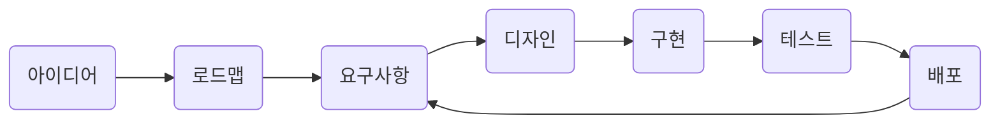

## 많은 회사에서 사용하는 업무 프로세스

이런 구조는 많은 회사에서 사용하는 업무 프로세스를 다이어그램으로 나타낸 것이다.

* 아이디어 : 내부 / 외부에서 생성된 아이디어가 구현사항이 된다.
* 로드맵 : 아이디어들의 우선 순위를 매겨 로드맵으로 구조를 짠다.
* 요구사항 : 이해 관계자를 만나서 아이디어를 구체적으로 바꾼다.
* 디자인 : UI / UX 디자인부터 산업 디자인까지 요구사항에 맞춘 디자인을 한다.
* 구현 : 엔지니어가 여기서 요술 노트북을 사용하여 뚝딱 결과물을 만든다.
* 테스트 : QA 엔지니어가 구현된 내용이 잘 동작 하는지 테스트를 한다.
* 배포 : 실제 고객에게 배포된다

## 이런 방식의 문제점은

1. 제품을 고객에게 전달하기까지 너무 오랜 시간이 걸린다.
2. 아이디어의 출처가 특정 사람들에게서만 나오게 된다.
3. 비즈니스 케이스에 대한 근거가 없다.
4. 아이디어를 계속해서 개선되어야 하는데, 문제 1번이 발목을 잡는다.
5. 디자이너 / 엔지니어들이 개발 프로세스에 늦게 참여한다.
	1. 디자인의 진정한 가치를 담는 대신 단순히 요구사항을 맞추는데만 급급하게 된다.
	2. 만약 구현을 못하는 이슈가 생길 경우... 🥲
6. 성과에 집중하는 대신 결과물에만 집중하게 된다
	* 제품의 목적은 누군가에게 이 솔루션을 팔기 위함이다
7. 고객에 대한 검증이 늦게 일어난다.

## 이 문제를 해결하려면...

### 위험 대응을 제일 먼저
고객이 이 제품을 구매할 것인지에 대한 고민이나, 사용성 이슈와 같은 서비스를 위협하는 이슈들을 제일 먼저 발견하고 대응한다

### 모든 사람이 함께 협업하며 정의한다
모든 이해 관계자 (엔지니어, 디자이너, 관리자) 가 함께 비즈니스 성과를 이뤄낼수 있는 (= 팔수 있는) 서비스를 만들수 있도록 협업한다

### 기능을 구현하는 것 대신 문제를 해결하는데 집중한다
위 로드맵은 결과물에만 집중하게 된다는 문제점이 있다. 