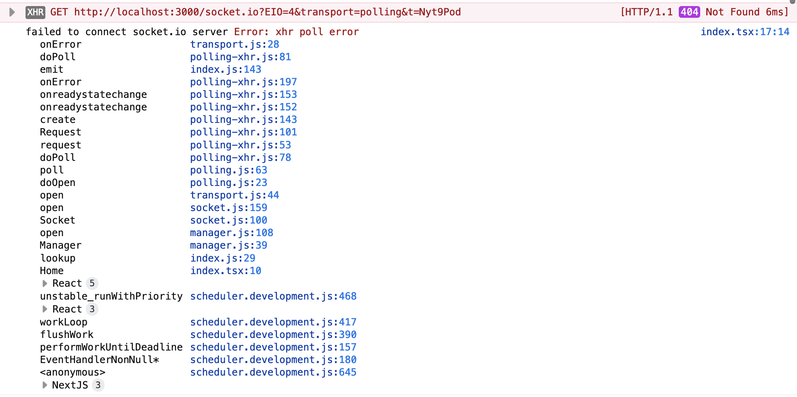
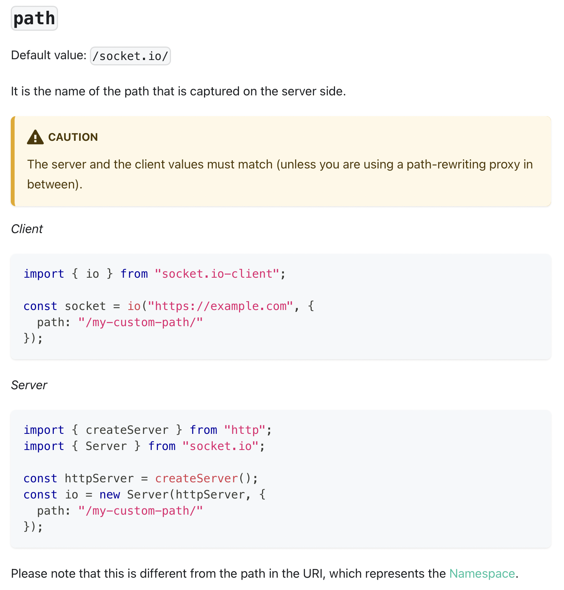
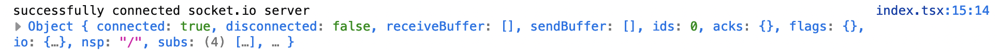
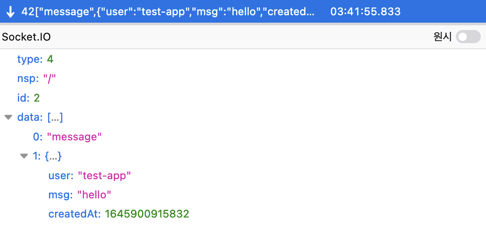
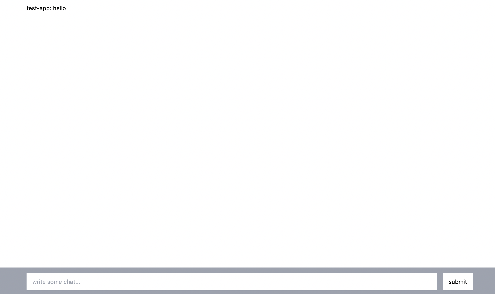

# 계기

채팅을 사용하는 새로운 토이프로젝트를 만들기 위해서 socket.io를 활용한 NextJS 어플리케이션 예제를 만들어보기로 했습니다.

근데 하는김에 '개발을 하면서 겪은 이야기들을 글로 써보면 어떨까?' 싶어서 이렇게 글로도 남겨보고자 합니다.


# 목표

이번 프로젝트에서 요구하는 기능들은 아래와 같습니다.

프로필 기능이나 채팅 로그와 같이 저장이 필요한 기능들은 데이터베이스를 사용할 예정입니다.

### 채팅 기능

- [ ] socket.io를 사용한 1:1 채팅 기능
- [ ] 유저끼리 한 채팅은 저장이 되어서 언제나 확인할 수 있음

### 프로필 기능

- [ ] 사진, 이름등을 수정할 수 있는 프로필 기능

### 기타 기능

- [ ] 유저 목록을 확인해서 채팅을 생성할 수 있음


# 오늘의 목표 : socket.io 기반의 1:1 채팅을 만들기

우선,`create-next-app` 을 사용하여 프로젝트를 init 합니다.

```bash
yarn create next-app nextjs-chat template --typescript
```

사용하는 패키지도 설치해줍니다.

```bash
yarn add prisma socket.io tailwindcss
```

tailwindcss와 prisma도 init 해줍니다.

```bash
# tailwindcss
yarn tailwindcss init -p

# prisma
yarn prisma init
```


## 타입 정의

우선 NextApiResponse에 SocketIO 객체를 포함한 `NextApiResponseServerIO` 타입을 만듭니다.

```typescript
import { NextApiResponse } from "next";
// nodeJS network api (https://nodejs.org/api/net.html)
import { Socket, Server as NetServer } from "net";
import { Server as SocketIOServer } from "socket.io";

export type NextApiResponseServerIO = NextApiResponse & {
	socket: Socket & {
		server: NetServer & {
			io: SocketIOServer;
		};
	};
};

```


## socket.io 서버 만들기

기존의 NextJS socket server에 socket.io 서버를 write 하는 방법으로 사용자가 socket.io 서버에 접속할 수 있도록 api route를 추가합니다.

```typescript
import { NextApiRequest } from "next";
import { NextApiResponseServerIO } from "types/next";
import { Server as ServerIO } from "socket.io";
import { Server as NetServer } from "http";

// custom config for disable bodyParser (https://nextjs.org/docs/api-routes/api-middlewares#custom-config)
export const config = {
	api: {
		bodyParser: false,
	},
};

export default async (req: NextApiRequest, res: NextApiResponseServerIO) => {
	if (!res.socket.server.io) {
		console.log("create new socket.io server");
		// adapt Next net server to http server
		const httpServer: NetServer = res.socket.server as any;
		res.socket.server.io = new ServerIO(httpServer, {
			path: "/api/socket.io",
		});
	}
	res.end();
};
```


## socket.io 연결하기

페이지가 마운트 되었을 때 socket 서버에 연결하는 기능을 추가합니다.

```typescript
import type { NextPage } from "next";
import { useEffect } from "react";
import { io } from "socket.io-client";

const Home: NextPage = () => {
  useEffect(() => {
    const socket = io("");

    socket.on("connect", () => {
      console.log("successfully connected socket.io server", socket);
    });

    socket.on("connect_error", (err) => {
      console.log("failed to connect socket.io server", err);
    });

    return () => {
      socket.disconnect();
    };
  }, []);

  return (
    // ...
  );
};

export default Home;

```


어라? 요청이 API 경로인 `/api/socket.io` 가 아니라 페이지 경로인 `/socket.io` 로 연결되고 있습니다.




[공식 문서](https://socket.io/docs/v4/client-options/#path) 를 살펴봅니다.

살펴보니 socket.io 를 init 할 때 path 라는 환경변수가 지정되어있지 않다면 기본값으로 `/socket.io` 로 설정된다고 합니다.




`io()`를 호출할 때 옵션 object에 path 값을 설정해봅니다.

```typescript
const socket = io("", {
  path: "/api/socket.io",
});
```


연결이 잘 됩니다! 만세!




## 기본적인 마크업 작성하기

메시지 객체를 담는 인터페이스 `IMsg`를 만듭니다.

```typescript
interface IMsg {
  user: string;
  msg: string;
  createdAt: number;
}
```

`index.tsx` 파일의 본문 부분을 다음과 같이 수정합니다.

`chat` 에는 지금까지 사용자가 보낸 채팅이 담깁니다.

* 만약 `chat`의 길이가 0이라면 (채팅을 보내고 받은 기록이 없다면) ''채팅 기록이 없습니다'' 라는 컨텐츠를 표시합니다.
* 만약 해당 채팅을 보낸 사람의 이름이 나와 같다면 (내가 보낸 채팅이라면) 사용자의 이름 대신 Me 를 출력합니다.

```jsx
const user = "User_" + String(~~(Math.random() * 1000000));

const [chat, setChat] = useState<IMsg[]>([]);

return (
  <>
    <Head>
      <title>Socket.io connect example</title>
      <link rel="icon" href="/favicon.ico" />
    </Head>
    <main className={"flex flex-col w-full h-screen"}>
      <div className={"flex-1"}>
        <div className="container mx-auto p-4">
          {chat.length ? (
            chat.map((chat, i) => (
              <div key={`msg_${i}`} className={"mb-1"}>
                <span className={chat.user === user ? "text-red-500" : ""}>
                  {chat.user === user ? "Me" : chat.user}
                </span>
                : {chat.msg}
              </div>
            ))
          ) : (
            <div className={"text-center text-gray-600 text-xl"}>채팅 기록이 없습니다.</div>
          )}
        </div>
      </div>
      {/* TODO: Add submit event */}
      <form onSubmit={() => null} className={"bg-gray-400 sticky bottom-0"}>
        <div className="container mx-auto flex items-center gap-x-4 p-4 h-20">
          <input className={"flex-1 h-full px-4"} type="text" name={"content"} placeholder={"write some chat..."} />
          <button className={"h-full px-4 bg-white"} type={"submit"}>
            submit
          </button>
        </div>
      </form>
    </main>
  </>
);
```

## 채팅을 보내는 API 엔드포인트 만들기

사용자가 `POST /chat` 로 사용자의 이름과 컨텐츠를 보내면 모든 사용자에게 채팅을 보내는 기능을 만들었습니다.

```typescript
import { NextApiRequest } from "next";
import { NextApiResponseServerIO } from "../../types/next";

export default async (req: NextApiRequest, res: NextApiResponseServerIO) => {
  if (req.method !== "POST") return res.status(405).end();

  const createdAt = Date.now();
  const body = {
    ...req.body,
    createdAt,
  };

  res?.socket?.server?.io?.emit("message", body);

  res.status(201).json(body);
};
```

Paw와 같은 CURL 툴로 요청을 보내면 이런식으로 요청이 출력됩니다.

## 채팅 이벤트가 발생했을 때 채팅 로그에 추가하기

채팅 이벤트가 발생했을 때 chat 배열에 컨텐츠 이벤트 핸들러를 추가합니다.

```typescript
// ...
socket.on("message", (message: IMsg) => {
  setChat((prev) => [...prev, message]);
});
// ...
```

이제 API 요청이 오면 컨텐츠에 표시됩니다.



## 채팅을 보내는 기능을 만들기

사용자가 form에 메시지를 입력하면 input의 값을 API로 호출하는 기능을 만들었습니다.

보통은 `useRef` 로 input 아이템을 컨트롤 하지만, 저같은 경우에는 `event.currentTarget`을 통해서 input의 value를 가져오는 방법을 주로 사용합니다.

```typescript
async function handleSubmit(event: FormEvent<HTMLFormElement>) {
  event.preventDefault();
  const input = event.currentTarget.content;

  const message = {
    user,
    msg: input.value,
  };

  await fetch("/api/chat", {
    method: "POST",
    headers: {
      "Content-Type": "application/json",
    },
    body: JSON.stringify(message),
  });

  input.value = "";
  input.focus();
}
```


<video src="create-chat-app-with-nextjs-socketio-prisma-day-1/it_works!.mov" controls  style={{ width: "100%" }}></video>


이걸 쓰고 잠시 잠을 자야겠습니다...

다음 글에서 만나요 👋
