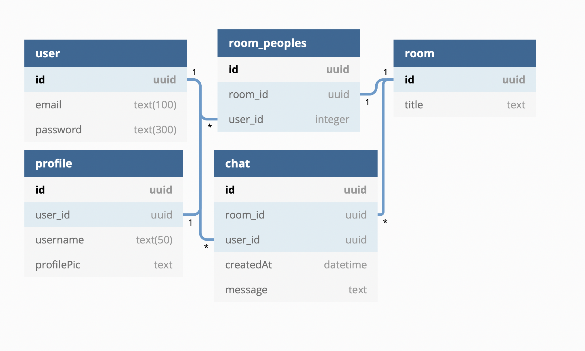
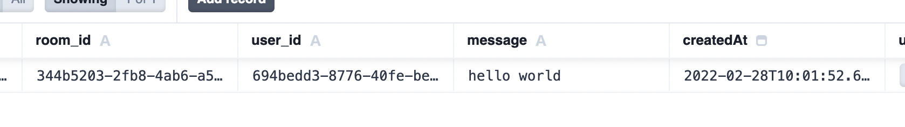
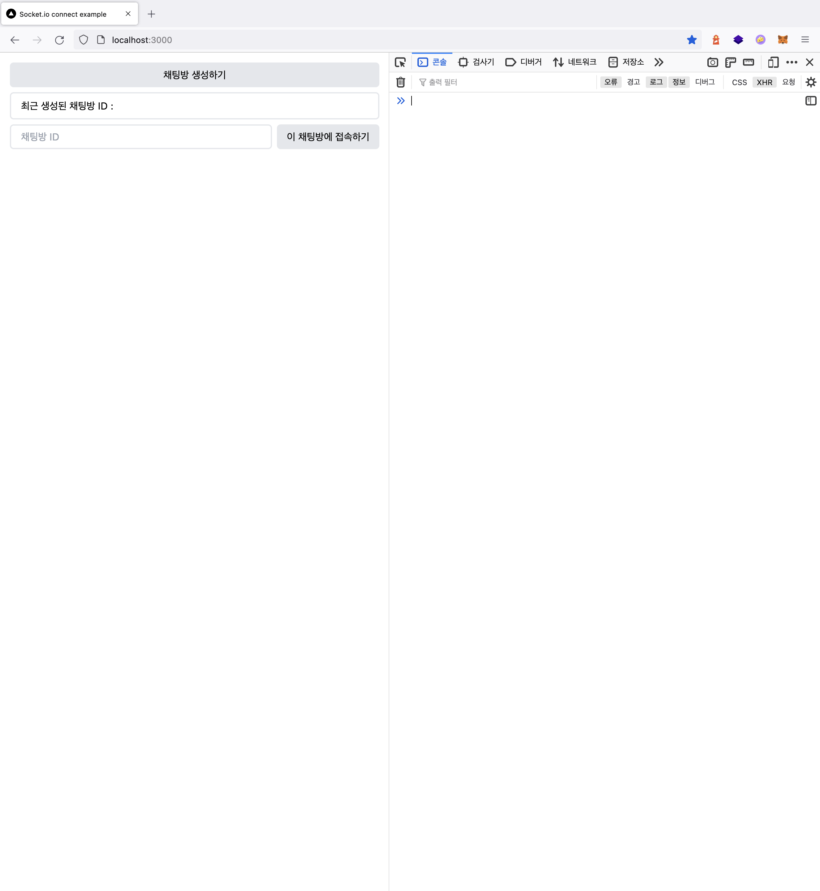
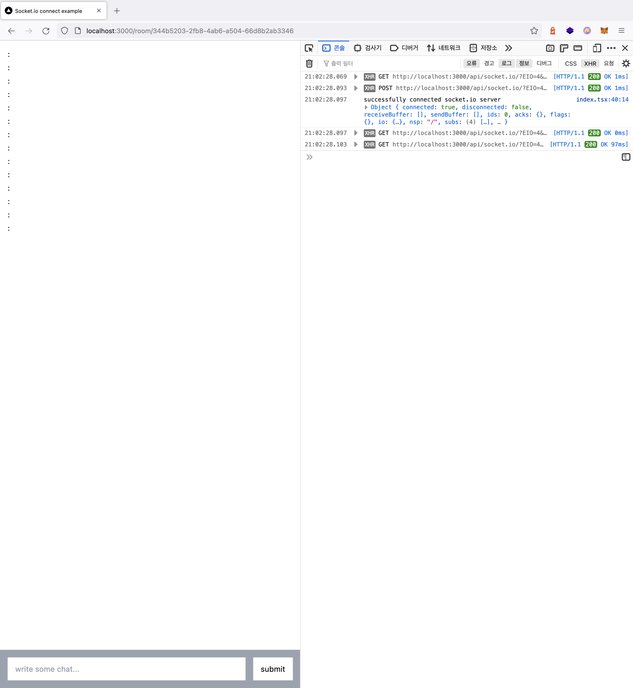
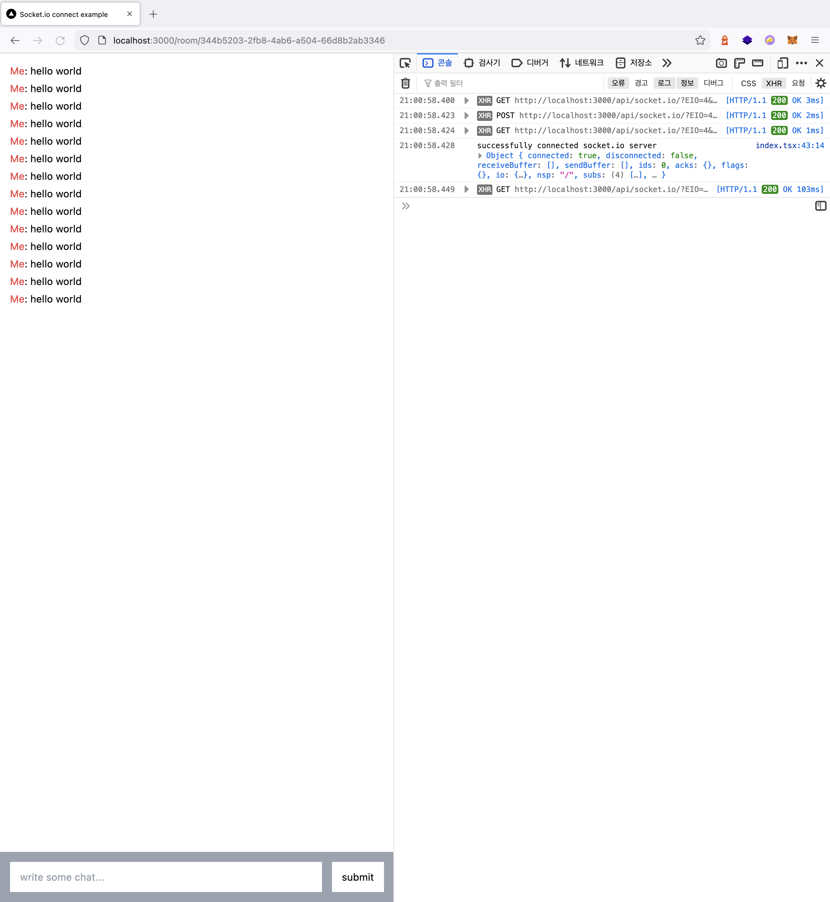
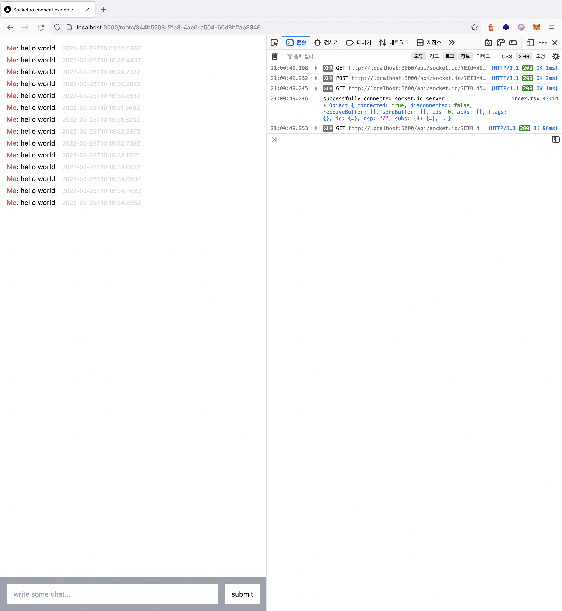
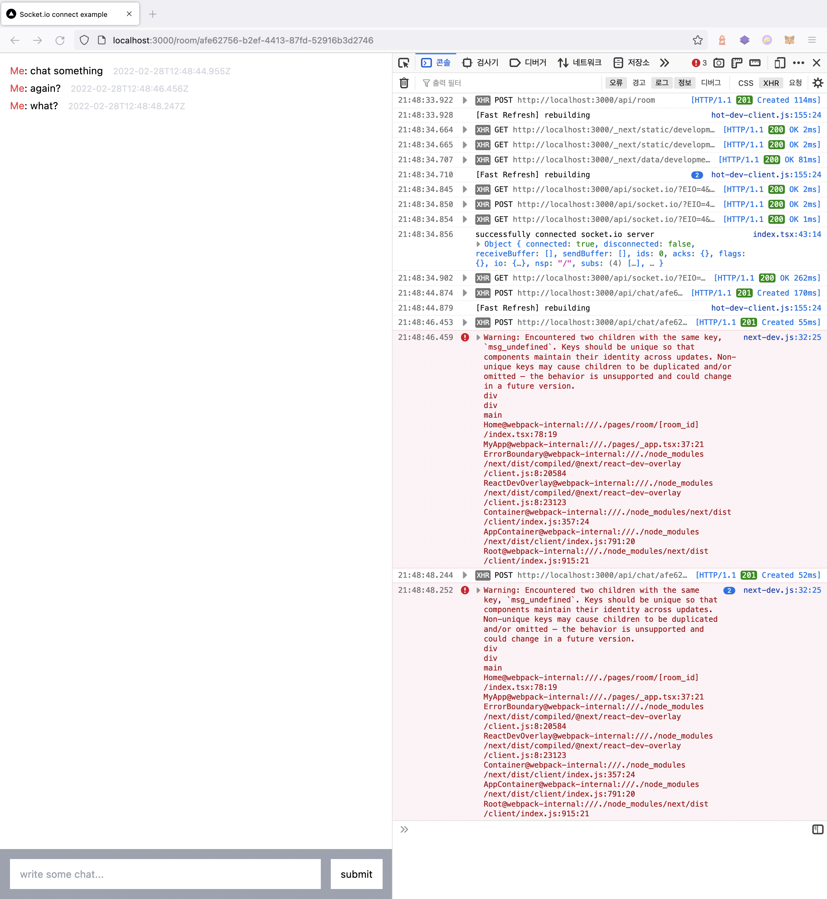
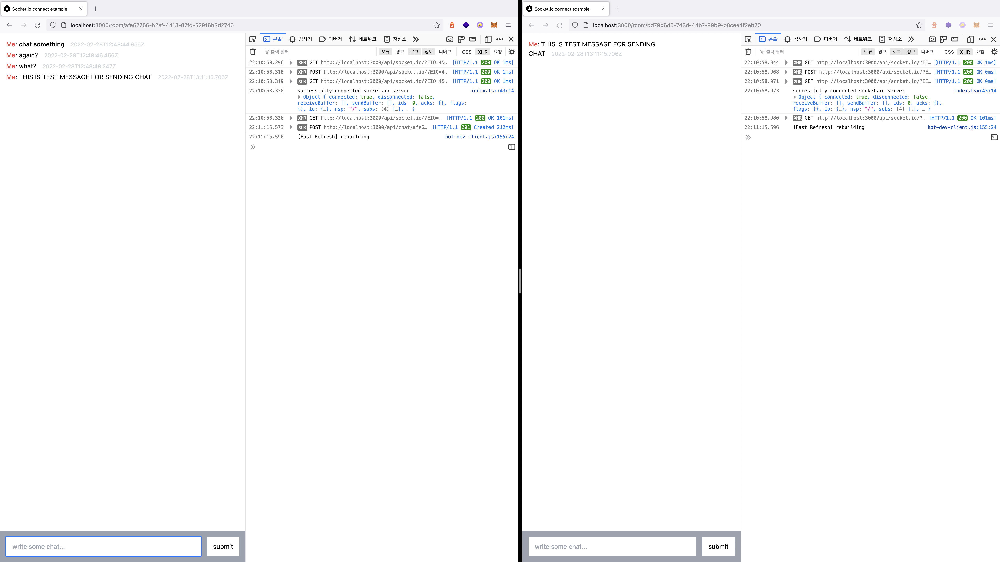

# 새로운 시작

세상에나 저는 이 글이 시리즈로 이루어질지는 예상하지도 못했네요...

이렇게 된 김에 열심히 끝까지 만들어서 완성까지 달려보도록 하겠습니다.


# 지난 시간 돌아보기 + 목표 설정하기

지난 시간에는 socket.io를 사용해서 사용자가 서비스에 접속하고 채팅을 보내면 다른 사용자에게 채팅을 보여주는 기능을 구현했습니다.

이번에는 사용자 계정을 만들고, 채팅방을 생성하는 기능까지 구현해보고자 합니다.

이 과정에서 사용자 인증이나 

### 채팅 기능

- [x] socket.io를 사용한 1:1 채팅 기능

- [ ] 유저끼리 한 채팅은 저장이 되어서 언제나 확인할 수 있음

### 프로필 기능

- [ ] 사진, 이름등을 수정할 수 있는 프로필 기능

### 기타 기능

- [ ] 유저 목록을 확인해서 채팅을 생성할 수 있음


# 데이터베이스 구조 만들기

새로운 날이 밝았고, 일어나자마자 저는 이 서비스에서 사용될 데이터베이스의 다이어그램을 그렸습니다.



테이블은 5개로 나뉘어져 있습니다.

* `user` : 로그인과 관련된 정보

* `profile` : 프로필과 연관된 정보

  `profile` 테이블과 `user` 테이블을 나눈 이유는 각 테이블이 하는 기능(꾸미는 기능, 로그인 기능)이 다르고, 로그인 정보를 수정하는 횟수보다 유저의 이름이나 프로필 사진을 바꾸는 횟수가 더 많을 것이라 예상했기 때문입니다.

* `room` : 채팅방에 대한 정보

* `room_peoples` : 채팅방에 참여한 사람들의 정보

* `chat` : 사람들이 보낸 채팅에 대한 정보

# ORM 모델 만들기

데이터베이스 모델을 기반으로 prisma의 모델을 정의합니다.

Profile 같은 경우에는 부가적인 기능이여서 정의만 하고 나중에 사용할 예정입니다.

```prisma
model User {
  id        String   @id @default(uuid())
  email     String   @unique
  password  String
  createdAt DateTime @default(now())

//  profiles     Profile[]
  joined_rooms UsersOnRoom[]
  sended_chats Chat[]
}

//model Profile {
//  id        String   @id @default(uuid())
//  user_id   String
//  username  String
//  thumbnail String?
//  createdAt DateTime @default(now())

//  user User @relation(fields: [user_id], references: [id])
//}

model UsersOnRoom {
  id        String   @id @default(uuid())
  room_id   String
  user_id   String
  createdAt DateTime @default(now())

  user User @relation(fields: [user_id], references: [id])
  room Room @relation(fields: [room_id], references: [id])
}

model Chat {
  id        String   @id @default(uuid())
  room_id   String
  user_id   String
  message   String
  createdAt DateTime @default(now())

  user User @relation(fields: [user_id], references: [id])
  room Room @relation(fields: [room_id], references: [id])
}

model Room {
  id        String   @id @default(uuid())
  title     String
  createdAt DateTime @default(now())

  users UsersOnRoom[]
  chats Chat[]
}
```

# Prisma Client 만들기

개발 환경에서 불필요한 `PrismaClient`가 계속해서 생성되지 않도록 `global.prisma` 에 한개의 클라이언트만 생성시키는 파일을 만듭니다.

```typescript
import { PrismaClient } from "@prisma/client";

declare global {
  var prisma: PrismaClient | undefined;
}

export const prisma =
  global.prisma ||
  new PrismaClient({
    log: ["query"],
  });

if (process.env.NODE_ENV !== "production") global.prisma = prisma;
```

# API 만들기 (MVP 편)

서비스의 MVP와 관련된 API들을 만듭니다.

사용자 인증이나 보안과 관련된 내용은 나중에 고려합니다.

## 유저를 만들기 (`POST /user`)

사용자가 `email`과 `password`를 입력하면 계정을 만드는 기능을 추가합니다.

API를 요청하는 단계에서는 비밀번호를 평문으로 보내지만 (HTTPS 연결을 사용하여 비밀번호를 하이재킹하기 어려움) 데이터베이스에는 sha-512로 암호화되어 저장합니다.

```typescript
import { NextApiRequest, NextApiResponse } from "next";
import { sha512 } from "js-sha512";
import { prisma } from "lib/prisma";

export default async (req: NextApiRequest, res: NextApiResponse) => {
  if (req.method === "POST") {
    const { email, password } = req.body;

    const { id, createdAt } = await prisma.user.create({
      data: {
        email,
        password: sha512(password),
      },
    });

    return res.status(201).json({
      id,
      email,
      createdAt,
    });
  } else {
    return res.status(405).end();
  }
};
```

## 채팅방을 만들기 (`POST /room`)

사용자가 API에 요청을 보내면 방을 생성한 다음 `socketJoin` 을 사용해 사용자를 채팅방에 추가합니다.

프론트엔드에서는 요청이 성공하면 리다이렉트로 보내는 기능을 추가할 예정입니다.

```typescript
import { NextApiRequest } from "next";
import { NextApiResponseServerIO } from "types/next";
import { prisma } from "lib/prisma";

export default async (req: NextApiRequest, res: NextApiResponseServerIO) => {
  if (req.method === "POST") {
    const { user_id, title } = req.body;

    const response = await prisma.usersOnRoom.create({
      data: {
        user: {
          connect: {
            id: user_id,
          },
        },
        room: {
          create: {
            title: title || "sample_room",
          },
        },
      },
    });

    res?.socket?.server?.io?.socketsJoin(response.room_id);

    return res.status(201).json(response);
  } else {
    return res.status(405).end();
  }
};

```

## 채팅방에 채팅을 보내는 기능 추가하기 (`POST /chat/[room_id]`)

기존의 `POST /chat`와 동작은 동일하지만 조금 다른 기능들이 있습니다.

* `[room_id]` 쿼리로 특정 채팅방에만 채팅을 보낼 수 있음
* 사용자가 채팅을 보낼 때 채팅방에 접속함
* 채팅을 보낸 기록이 DB에 저장됨

```typescript
import { NextApiRequest } from "next";
import { NextApiResponseServerIO } from "types/next";
import { prisma } from "lib/prisma";

export default async (req: NextApiRequest, res: NextApiResponseServerIO) => {
  // block if method is not supported
  if (req.method !== "POST") return res.status(405).end();

  const { user_id, msg: message } = req.body;
  const { room_id } = req.query;

  const createdAt = Date.now();
  const body = {
    ...req.body,
    createdAt,
  };

  res.socket?.server?.io?.socketsJoin(room_id);
  res?.socket?.server?.io?.to(room_id)?.emit("message", body);

  await prisma.chat.create({
    data: {
      user: {
        connect: {
          id: user_id,
        },
      },
      room: {
        connect: {
          id: String(room_id),
        },
      },
      message,
    },
  });

  res.status(201).json(body);
};

```

API에 요청을 보내면...

```typescript
axios({
	"method": "POST",
	"url": "http://localhost:3000/api/chat/344b5203-2fb8-4ab6-a504-66d8b2ab3346",
	"headers": {
		"Content-Type": "application/json; charset=utf-8"
	},
	"data": {
		"user_id": "694bedd3-8776-40fe-be5a-584d1021ebae",
		"msg": "hello world"
	}
})
```

정상적으로 데이터베이스에 입력되는것을 확인할 수 있습니다.



## 채팅방에서 보내진 메시지를 확인하기 (`GET /room/[room_id]`)

사용자가 다시 채팅방에 참여했을 때 지금까지 보낸 채팅 기록을 확인할 수 있도록 합니다.

```typescript
import { NextApiRequest } from "next";
import { NextApiResponseServerIO } from "types/next";
import { prisma } from "lib/prisma";

export default async (req: NextApiRequest, res: NextApiResponseServerIO) => {
  const room_id = String(req.query.room_id);

  if (req.method === "GET") {
    const response = await prisma.chat.findMany({
      where: {
        room_id,
      },
    });

    res.json(response);
  } else {
    // block if method is not supported
    return res.status(405).end();
  }
};
```

정상적으로 출력됩니다. 야호

```json
[
	{
		"createdAt": "2022-02-28T10:01:52.636Z",
		"id": "6fecb00d-f9b9-43ce-9eab-aae1b8cfb52f",
		"message": "hello world",
		"room_id": "344b5203-2fb8-4ab6-a504-66d8b2ab3346",
		"user_id": "694bedd3-8776-40fe-be5a-584d1021ebae"
	},
]
```

# 프론트엔드와 연결하기

API에 대응하는 기능들을 즐거운 마음으로 추가해봅니다.

## 마크업 재작성하기

Home 페이지에 있던 채팅 레이아웃을 `/room/[room_id].tsx`로 옮깁니다.

그리고 Home 페이지에는 채팅방을 생성하는 기능을 만들었습니다.

```tsx
import type { NextPage } from "next";
import Head from "next/head";
import { FormEvent, useRef, useState } from "react";
import { useRouter } from "next/router";

const Home: NextPage = () => {
  const { push } = useRouter();
  const inputRef = useRef<HTMLInputElement>(null);
  const [roomId, setRoomId] = useState<string>("");

  async function handleRoomCreate() {}

  async function handleRoomJoin(event: FormEvent<HTMLFormElement>) {}

  return (
    <>
      <Head>
        <title>Socket.io connect example</title>
        <link rel="icon" href="/favicon.ico" />
      </Head>
      <main className={"flex flex-col gap-y-2 p-4 w-full h-screen border-gray-200"}>
        <button onClick={handleRoomCreate} className={"px-4 py-2 bg-gray-200 rounded-md"}>
          채팅방 생성하기
        </button>
        <div className={"px-4 py-2 border-2 rounded-md"}>최근 생성된 채팅방 ID : {roomId}</div>
        <form onSubmit={handleRoomJoin} className={"flex gap-2"}>
          <input
            ref={inputRef}
            className={"flex-1 border-2 px-4 rounded-md"}
            type="text"
            name={"room_id"}
            placeholder={"채팅방 ID"}
          />
          <button className={"px-4 py-2 bg-gray-200 rounded-md"}>이 채팅방에 접속하기</button>
        </form>
      </main>
    </>
  );
};

export default Home;

```

그러면 이런 단순한 디자인의 메인 페이지가 만들어집니다.



## 메인 페이지에 기능들을 추가하기

마크업을 작성했으니 기능들을 추가해봅시다.

이 페이지에서는 이런 기능들이 있어야 하는데...

* 버튼을 누르면 새로운 방을 생성하는 기능
* 방의 ID를 form에 입력하면 해당 방으로 이동하는 기능

하나씩 만들어봅시다.

### 버튼을 누르면 새로운 방을 생성하는 기능

```typescript
async function handleRoomCreate() {
  // create room
  const response = await fetch("http://localhost:3000/api/room", {
    method: "POST",
    headers: {
      "Content-Type": "application/json",
    },
    body: JSON.stringify({
      user_id: "694bedd3-8776-40fe-be5a-584d1021ebae",
    }),
  });

  if (response.ok) {
    const data = await response.json();
    setRoomId(data.room_id);
    if (inputRef.current) {
      inputRef.current.value = data.room_id;
    }
  }
}
```

### 방의 ID를 입력하면 해당 방으로 이동하는 기능

```typescript
async function handleRoomJoin(event: FormEvent<HTMLFormElement>) {
  event.preventDefault();
  if (inputRef.current) await push(`/room/${inputRef.current.value}`);
}
```

생각보다 기능 구현은 단순했습니다.

결과적으로, 메인페이지는 이런식으로 작동하게 됩니다.

<video controls src="create-chat-app-with-nextjs-socketio-prisma-day-2/well_done.mov" style={{ width: "100%" }}></video>

## 채팅 페이지에 기능들을 추가하기

이제 채팅 페이지에 기능들을 추가하거나 변경해보겠습니다.

* 페이지에 접속했을 때 기존에 채팅 기록이 있으면 기존 채팅 내역을 SSR(서버사이드렌더링)으로 표시
* 변경된 메시지 스팩에 맞게 typescript 인터페이스 수정하기
* 다른 사용자가 채팅을 보내면 해당 채팅방에만 표시되어야 함

### 페이지에 접속했을 때 기존의 채팅 기록 표시하기

`/room/[room_id].tsx` 에 getServerSideProps를 추가해서 기존의 채팅 기록을 확인할 수 있도록 만듭니다.

```typescript
import type { GetServerSideProps } from "next";

interface IProps {
  room_id: string;
  msg: IMsg[];
}

export const getServerSideProps: GetServerSideProps<IProps> = async (ctx) => {
  const room_id = String(ctx.query.room_id);

  const response = await fetch(`http://localhost:3000/api/room/${room_id}`);
  const msg = await response.json();

  return {
    props: {
      room_id,
      msg,
    },
  };
};

// NextJS Page...
const Home: NextPage<IProps> = ({ room_id, msg }) => {
  // useEffect...
  
  const [chat, setChat] = useState<IMsg[]>(msg);
  
  // NextJS Page...
}
```

### 변경된 메시지 스팩에 맞게 인터페이스 수정하기

기존의 메시지 구조는 아래와 같이 단순한 구조였지만...

```typescript
interface iMsg {
  user: string;
  msg: string;
  createdAt: number;
}
```

데이터베이스가 추가되면서 이런 구조로 변경되었습니다.

```typescript
interface IMsg {
  id: string;
  room_id: string;
  user_id: string;
  message: string;
  createdAt: string;
}
```

그러다보니 컨텐츠가 정상적으로 표시가 되지 않는 이슈가 생겼습니다.



이에 맞춰서 채팅을 표시하는 map 함수의 내용들을 수정했습니다.

```jsx
import type { GetServerSideProps, NextPage } from "next";
import { FormEvent, useEffect, useState } from "react";
import { io } from "socket.io-client";

interface IMsg {
  id: string;
  room_id: string;
  user_id: string;
  message: string;
  createdAt: string;
}

// interface...

// TODO: must changed hard-coded user id
const user = "694bedd3-8776-40fe-be5a-584d1021ebae";

// server side props...

const Home: NextPage<IProps> = ({ msg }) => {
  // business logic ...

  return (
    <>
      {/* header ... */}
      <main className={"flex flex-col w-full h-screen"}>
        <div className={"flex-1"}>
          <div className="container mx-auto p-4">
            {chat.length ? (
              chat.map((chat) => (
                <div key={`msg_${chat.id}`} className={"mb-1"}>
                  <span className={chat.user_id === user ? "text-red-500" : ""}>
                    {chat.user_id === user ? "Me" : chat.user_id.slice(0, 8)}
                  </span>
                  : {chat.message}
                </div>
              ))
            ) : (
              <div className={"text-center text-gray-600 text-xl"}>채팅 기록이 없습니다.</div>
            )}
          </div>
        </div>
        {/* form ... */}
      </main>
    </>
  );
};

export default Home;
```

이제 다시 컨텐츠가 정상적으로 출력됩니다.



### 이 유저가 언제 채팅을 보냈는지 확인할 수 있게 하기

단순하지만 해당 유저가 채팅을 언제 전송했는지 확인할 수 있도록 타임스탬프를 추가했습니다.

```jsx
chat.map((chat) => (
  <div key={`msg_${chat.id}`} className={"mb-1"}>
    <span className={chat.user_id === user ? "text-red-500" : ""}>
      {chat.user_id === user ? "Me" : chat.user_id.slice(0, 8)}
    </span>
    : {chat.message}
    <span className={"ml-4 text-sm text-gray-300"}>{chat.createdAt}</span>
  </div>
))
```



### socket.io와 관련된 부분을 수정하기

2일차에서는 채팅방 이라는 개념이 새롭게 추가되면서 채팅방에서 발생한 채팅 이벤트는 해당 채팅방에서만 보여져야 한다는 목표가 추가되었습니다.

그래서 특정 채팅방에서만 채팅을 보낼 수 있도록 `handleSubmit` 의 fetch 부분을 일부 수정했습니다.

```typescript
const message = {
  user_id: user,
  message: input.value,
};

await fetch(`/api/chat/${room_id}`, {
  method: "POST",
  headers: {
  "Content-Type": "application/json",
  },
  body: JSON.stringify(message),
});
```

채팅은 잘 보내지고 데이터베이스에도 잘 입력이 되는데...

여러 문제와 버그가 보입니다. 울고싶습니다.



# 트러블슈팅하기

우선 이슈 사항들을 잘게 나눠보도록 하겠습니다.

* 새로 보낸 채팅에 key가 중복되어 생성되는 문제 : 왜 `chat.id`는 `undefined` 일까
* 접속하지 않은 다른 방에도 채팅이 표시되는 문제

## key가 중복되는 문제 왜 `chat.id`는 undefined일까?

채팅을 2개 이상 보낼때 element의 key가 `msg_undefined`로 동일하다는 경고가 출력되고 있습니다.

어라? 이상합니다. 분명 저는 key를 `msg_${chat.id}` 으로 작성해서 `msg_undefined` 가 출력된다면 `chat.id` 가 `undefined`라는 뜻이 되게 됩니다.

만약 `chat.id` 가 문제였다면 SSR로 가져온 채팅 내역에도 문제가 있어야 합니다.

우선 채팅을 보내는 API인 `POST /chat/[room_id]` 부터 다시 확인해봅니다.

기존의 코드를 다시 보니 무언가 잘못되었습니다.

```typescript
const createdAt = Date.now();
const body = {
  ...req.body,
  createdAt,
};

res.socket?.server?.io?.socketsJoin(room_id);
res?.socket?.server?.io?.to(room_id)?.emit("message", body);

await prisma.chat.create({
  // database insert...
});

res.status(201).json(body);
```

아하!

기존에는 socket.io에 이벤트를 emit 하고 => 데이터베이스에 insert 하는 순서로 사용자에게 채팅이 전송되게 됩니다.

데이터베이스에 입력될때는 prisma가 uuid를 자동으로 지정해줘서 `chat.id` 가 정상적으로 출력되지만, socket.io에서 emit 될 때는 `id` 값이 지정되지 않았고, 결과적으로 `chat.id` 가 `undefined`로 출력되어 이런 오류가 발생했던 것입니다.

```typescript
import { NextApiRequest } from "next";
import { NextApiResponseServerIO } from "types/next";
import { prisma } from "lib/prisma";

export default async (req: NextApiRequest, res: NextApiResponseServerIO) => {
  // block if method is not supported
  if (req.method !== "POST") return res.status(405).end();

  const { user_id, message } = req.body;
  const { room_id } = req.query;

  const data = await prisma.chat.create({
    data: {
      user: {
        connect: {
          id: user_id,
        },
      },
      room: {
        connect: {
          id: String(room_id),
        },
      },
      message,
    },
  });

  res.socket?.server?.io?.socketsJoin(room_id);
  res?.socket?.server?.io?.to(room_id)?.emit("message", data);

  res.status(201).json(data);
};

```

데이터베이스에 값을 insert 하고 나온 데이터를 socket.io에 emit 하도록 API의 구조를 변경함으로써 문제를 해결했습니다.

야호!

## 다른 채팅방에서 보낸 메시지가 내 채팅방에서 표시된다고...?



채팅방이 다르면 메시지가 보내지지 않아야 하는데 보내지고 있습니다.

코드를 다시 살펴봅시다. 

```typescript
res.socket?.server?.io?.socketsJoin(room_id);
res?.socket?.server?.io?.to(room_id)?.emit("message", data);
```

우선 `socketsJoin` 쪽에서 문제의 근본적인 원인이 발견되었습니다.

`res.socket.server.io` 는 socket.io 서버에 붙은 모든 클라이언트를 지칭하고 있는데, 여기에 `socketsJoin` 을 실행해서 모든 사람에게 채팅방을 접속시켜 생긴 문제였습니다.

이것을 해결하기 위해서 채팅방에 참여하는 로직과 채팅을 보내는 로직을 분리시켰고, 사용자는 이제 채팅 페이지에 접속할 때 `GET /room/[room_id]`를 호출하여 채팅방의  join / leave 이벤트를 관리합니다.

```typescript
import { NextApiRequest } from "next";
import { NextApiResponseServerIO } from "types/next";

export default async (req: NextApiRequest, res: NextApiResponseServerIO) => {
  const { room_id } = req.query;

  if (req.method === "GET") {
    res.socket.server.io.once("connection", (socket) => {
      console.log(`client ${socket.id} has connected`);

      // do not make duplicate join chat-room
      if (!socket.rooms.has(String(room_id))) {
        console.log(`client ${socket.id} has joined ${room_id}`);
        socket.join(room_id);
      }

      // handle disconnect
      socket.on("disconnect", (reason) => {
        console.log(`client ${socket.id} has disconnected ${reason}`);
        socket.leave(String(room_id));
      });
    });

    res.end();
  } else {
    return res.status(405).end();
  }
};
```

* 채팅방을 만들때와 채팅을 보낼 때 `socketsJoin` 을 사용하여 채팅방에 접속시키는 로직들도 이 단계에서 제거했습니다.
* 채팅방에서 보내진 채팅을 가져오는 로직은 `GET /room/[room_id]/chat`로 이동시켰습니다.


# 회고

갑자기 생긴 채팅방 중복 문제로 인해서 10시부터 다음날 새벽 1시까지 3시간 정도를 고민했는데, 꽤나 힘들었습니다.

이제 하드코딩된 유저 정보를 별도의 유저 정보로 분리하고 인증과 관련된 로직만 추가하면 기초적인 기능들이 완성될 것 같습니다.

그럼 안녕히 주무세요 👋

긴 글 읽어주셔서 감사합니다 :>
