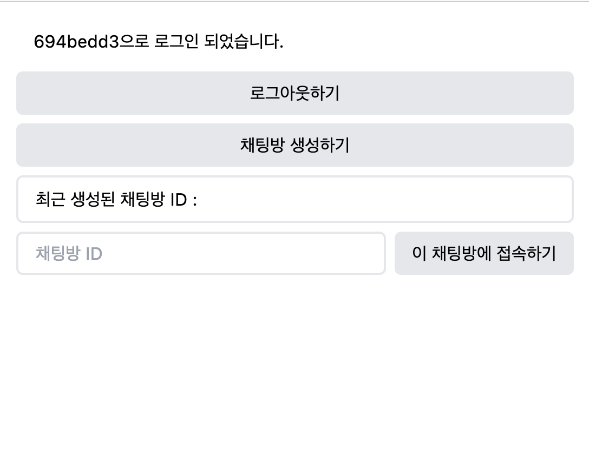
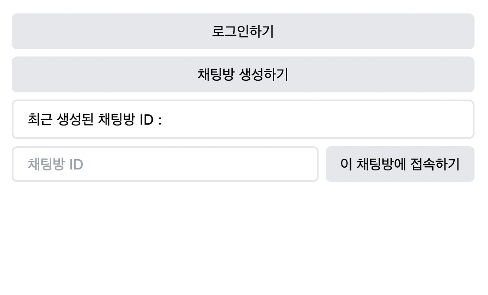
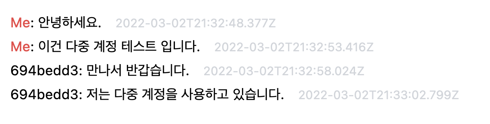
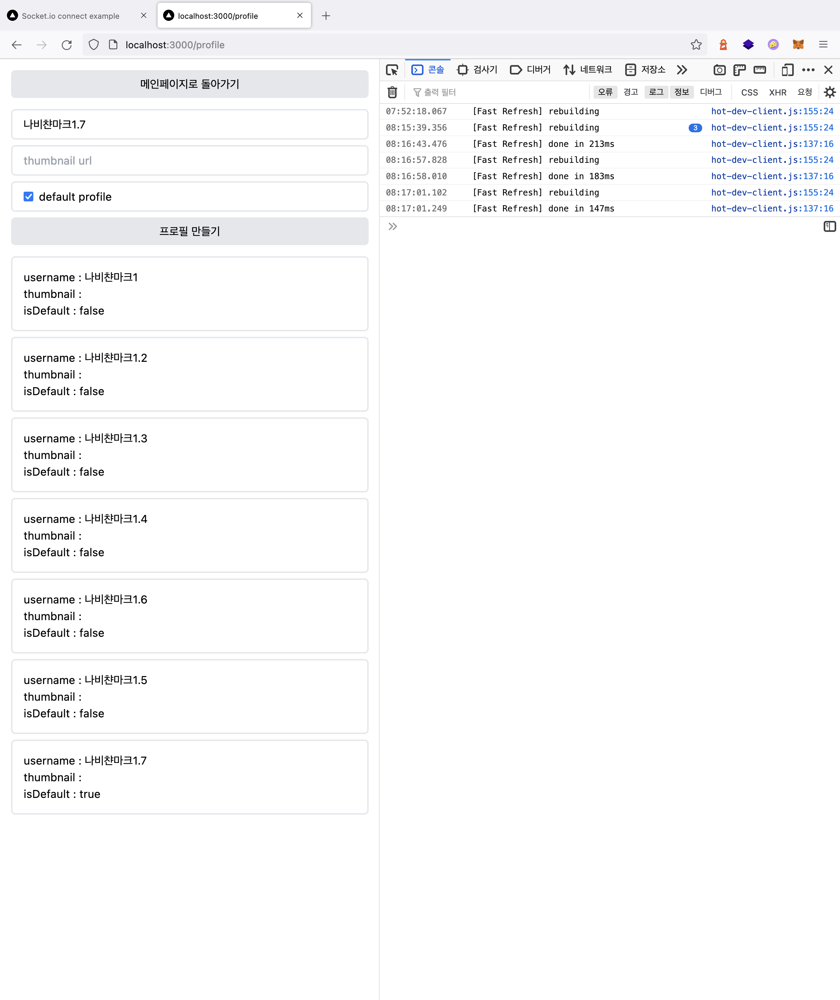

# 지난 시간 돌아보기 + 목표 설정하기

지난 시간에는 사용자 계정을 만들고 채팅방을 생성한 다음 채팅을 보낸 기록을 저장하는 기능까지 만들었습니다.

이제 절반 왔다는 생각에 나루토와 사스케의 웅장한 싸움을 볼때처럼 가슴이 웅장해졌습니다.

이번 시간에는 로그인 / 로그아웃 기능과 프로필 기능들을 만들고자 합니다.

오늘도 화이팅.

### 채팅 기능

- [x] socket.io를 사용한 1:1 채팅 기능
- [x] 유저끼리 한 채팅은 저장이 되어서 언제나 확인할 수 있음

### 프로필 기능

- [ ] 사진, 이름등을 수정할 수 있는 프로필 기능

### 기타 기능

- [ ] 유저 목록을 확인해서 채팅을 생성할 수 있음


# 유저의 정보를 담는 Context 만들기

유저의 정보를 담는 작업들을 하는 Context를 만들었습니다.

로그인을 하는 작업들은 다음 챕터에서 작업할 예정입니다.

```tsx
import { createContext, FC, useEffect, useState } from "react";

interface IUserContext {
  userId: string;
  jwtToken: string;
  login: () => void;
  logout: () => void;
}

const doNothing = () => undefined;

export const UserContext = createContext<IUserContext>({
  userId: "",
  jwtToken: "",
  login: doNothing,
  logout: doNothing,
});

const UserContextProvider: FC = ({ children }) => {
  const [userId, setUserID] = useState<string>("");
  const [jwtToken, setJwtToken] = useState<string>("");

  useEffect(() => {
    // TODO: login when cookie has jwt token
    // TODO: remove hard-coded userId
    setUserID("694bedd3-8776-40fe-be5a-584d1021ebae");

    return logout;
  }, []);

  function login() {
    // TODO: fetch user info
    // TODO: Apply user info from JWT token
  }

  function logout() {
    setUserID("");
    setJwtToken("");
  }

  return (
    <UserContext.Provider
      value={{
        userId,
        jwtToken,
        login,
        logout,
      }}
    >
      {children}
    </UserContext.Provider>
  );
};

export default UserContextProvider;
```


매번 `useContext(UserContext)`를 매번 import 하지 않도록 템플릿 함수인 `useUserContext` Hook도 만들어줍니다.

```typescript
import { useContext } from "react";
import { UserContext } from "context/userContext";

export const useUserContext = () => useContext(UserContext);
```


채팅방 페이지에 하드코딩 했었던 `user` 변수도 userContext의 값을 따르도록 변경했습니다.

```tsx
//...

import { useUserContext } from "hooks/useUserContext";

// ...

const Home: NextPage<IProps> = ({ room_id, msg }) => {
  const { userId } = useUserContext();

  // ...

  async function handleSubmit(event: FormEvent<HTMLFormElement>) {
    // ...
    
    const message = {
      user_id: userId,
      message: input.value,
    };

    // ...
  }

  return (
    <>
      {/* ... */}
      <main className={"flex flex-col w-full h-screen"}>
        <div className={"flex-1"}>
          <div className="container mx-auto p-4">
            {chat.length ? (
              chat.map((chat) => (
                <div key={`msg_${chat.id}`} className={"mb-1"}>
                  <span className={chat.user_id === userId ? "text-red-500" : ""}>
                    {chat.user_id === userId ? "Me" : chat.user_id.slice(0, 8)}
                  </span>
                  : {chat.message}
                  <span className={"ml-4 text-sm text-gray-300"}>{chat.createdAt}</span>
                </div>
              ))
            ) : (
              <div className={"text-center text-gray-600 text-xl"}>채팅 기록이 없습니다.</div>
            )}
          </div>
        </div>
        {/* ... */}
      </main>
    </>
  );
};

export default Home;
```


# 로그인 & 로그아웃 기능 만들기

이메일을 기반으로 한 로그인 / 로그아웃 기능을 만들어보고자 합니다.


## `POST /user/login`  만들기

사용자가 이메일과 비밀번호를 제시하면 유저 정보를 찾아서 반환하는 API를 만들었습니다.

```typescript
import { NextApiRequest, NextApiResponse } from "next";
import { prisma } from "lib/prisma";
import { sha512 } from "js-sha512";

export default async (req: NextApiRequest, res: NextApiResponse) => {
  if (req.method === "POST") {
    const { email, password } = req.body;

    const response = await prisma.user.findFirst({
      select: {
        id: true,
        password: false,
      },
      where: {
        email,
        password: sha512(password),
      },
    });

    return res.status(200).json({
      id: response?.id,
      jwtToken: "",
    });
  } else {
    res.status(405).end();
  }
};
```


## `UserContext` 구조 변경하기

`UserContext` 내부에 있던 `login` 함수를 userId와 jwtToken을 인자로 받는 함수인 `setUserInfo` 로 변경했습니다.

이왕 하는김에 하드코드된 `setUserID` 도 제거했습니다.

```tsx
// ...

interface IUserContext {
  userId: string;
  jwtToken: string;
  setUserInfo: (user: IUserInfo) => void;
  logout: () => void;
}

// ...

export const UserContext = createContext<IUserContext>({
  userId: "",
  jwtToken: "",
  setUserInfo: doNothing,
  logout: doNothing,
});

const UserContextProvider: FC = ({ children }) => {
  // ...

  function setUserInfo({ userId, jwtToken }: IUserInfo) {
    setUserID(userId);
    setJwtToken(jwtToken);
  }

  // ...
};

export default UserContextProvider;
```


## 로그인 페이지를 추가하기

로그인 페이지를 추가했습니다.

```tsx
import { NextPage } from "next";
import { FormEvent } from "react";
import { useUserContext } from "hooks/useUserContext";
import { useRouter } from "next/router";
import Link from "next/link";

const Login: NextPage = () => {
  const { setUserInfo } = useUserContext();
  const { push } = useRouter();

  async function handleSubmit(event: FormEvent<HTMLFormElement>) {
    event.preventDefault();
    const { email, password } = event.currentTarget;

    const response = await fetch("http://localhost:3000/api/user/login", {
      method: "POST",
      headers: {
        "Content-Type": "application/json",
      },
      body: JSON.stringify({
        email: email.value,
        password: password.value,
      }),
    });

    if (response.ok) {
      const { id: userId, jwtToken } = await response.json();
      setUserInfo({
        userId,
        jwtToken,
      });
      await push("/");
    }
  }

  return (
    <main>
      <form className={"flex flex-col gap-y-2 p-4 w-full h-screen border-gray-200"} onSubmit={handleSubmit}>
        <Link href={"/"}>
          <a className={"bg-gray-200 py-2 px-4 rounded-md text-center"}>메인페이지로 돌아가기</a>
        </Link>
        <input className={"border-2 py-2 px-4 rounded-md"} type="email" name="email" placeholder={"email"} />
        <input className={"border-2 py-2 px-4 rounded-md"} type="password" name="password" placeholder={"password"} />
        <button type="submit" className={"bg-gray-200 px-4 py-2 rounded-md text-center"}>
          로그인
        </button>
      </form>
    </main>
  );
};

export default Login;
```


그리고 메인페이지에 로그인 페이지로 가는 링크를 추가했습니다.

```tsx
// ...
import Link from "next/link";

const Home: NextPage = () => {
  // ...

  return (
    <>
      {/* ... */}
      <main className={"flex flex-col gap-y-2 p-4 w-full h-screen border-gray-200"}>
        <Link href={"/login"}>
          <a className={"px-4 py-2 bg-gray-200 rounded-md text-center"}>로그인하기</a>
        </Link>
        {/* ... */}
      </main>
    </>
  );
};

export default Home;
```


## 로그인시 사용자 아이디를 표시하기

사용자의 세션이 없을 때 로그인 버튼을 출력시키고, 세션이 있다면 로그아웃 버튼을 출력시키는 기능을 작업했습니다.

```tsx
// ...

const Home: NextPage = () => {
  // ...
  const { userId, logout } = useUserContext();
  // ...

  return (
    <>
      {/* ... */}
      <main className={"flex flex-col gap-y-2 p-4 w-full h-screen border-gray-200"}>
        {!!userId ? (
          <>
            <span className={"px-4 py-2"}>{userId.slice(0, 8)}으로 로그인 되었습니다.</span>
            <button onClick={logout} className={"px-4 py-2 bg-gray-200 rounded-md"}>
              로그아웃하기
            </button>
          </>
        ) : (
          <Link href={"/login"}>
            <a className={"px-4 py-2 bg-gray-200 rounded-md text-center"}>로그인하기</a>
          </Link>
        )}
        {/* ... */}
      </main>
    </>
  );
};

export default Home;
```






## 완성!

이제 똑같은 채팅방에 다른 유저가 채팅을 보낼 수 있습니다.



# 프로필 기능 만들기

이렇게 끝내기에는 너무 아쉽습니다.

그래서 프로필 기능까지 오늘 만들고자 합니다.

## `Profile` 모델 주석 해제하기

주석처리 해두었던 `Profile` 모델의 주석을 풉니다.

```prisma
// ...

model User {
	// ...

  profiles     Profile[]
	// ...
}

model Profile {
  id        String   @id @default(uuid())
  user_id   String
  username  String
  thumbnail String?
  createdAt DateTime @default(now())

  user User @relation(fields: [user_id], references: [id])
}

// ...
```

그리고 데이터베이스를 업데이트합니다.

```bash
$ yarn prisma db push

# Environment variables loaded from .env
# Prisma schema loaded from prisma/schema.prisma
# Datasource "db": PostgreSQL database {database_table}, schema "public" at "{database_url}:{database_port}"
#
# The database is already in sync with the Prisma schema.
#
# ✔ Generated Prisma Client (3.10.0 | library) to ./node_modules/@prisma/client in 49ms
```


## 백엔드 구조 변경하기

프로필 기능이 추가되면서, 계정을 생성할 때 프로필도 같이 만들도록 기능을 추가했습니다.

```typescript
// ...

export default async (req: NextApiRequest, res: NextApiResponse) => {
  if (req.method === "POST") {
    const { email, password, username } = req.body;

    const { id, createdAt } = await prisma.user.create({
      data: {
        // ...
        profiles: {
          create: {
            username: username,
          },
        },
      },
    });

    // ...
  } else {
    return res.status(405).end();
  }
};

```


## 메인 프로필을 찾는 기능을 추가하기

생각해보니, 유저가 가질 수 있는 프로필은 여러개인데 어떤 프로필이 기본이 되는 프로필인지를 고려하지 않고 설계가 되었습니다.

그래서 `Profile` 모델에 해당 프로필이 메인 프로필인지 확인하는 column을 추가했습니다.

```prisma
// ...

model Profile {
  // ...
  
  isDefault Boolean  @default(false)
  
  // ...
}


// ...
```


### `POST /user/profile` 작업하기

유저의 프로필을 만드는 API를 작업했습니다.

만약 `isDefault` 값이 `true` 라면 (이 프로필을 앞으로 기본 프로필로 사용할 경우) DB transaction을 사용해 기존 프로필의 `isDefault` 값을 `false` 로 설정합니다.

```typescript
import { NextApiRequest, NextApiResponse } from "next";
import { prisma } from "lib/prisma";

export default async (req: NextApiRequest, res: NextApiResponse) => {
  if (req.method === "POST") {
    const { user_id, username, thumbnail, isDefault } = req.body;

    await prisma.$transaction([
      // set default false when isDefault is true
      isDefault &&
        prisma.profile.updateMany({
          where: {
            user_id,
            isDefault: true,
          },
          data: {
            isDefault: false,
          },
        }),
      // create new profile
      prisma.profile.create({
        data: {
          username,
          thumbnail,
          isDefault,
          user: {
            connect: {
              id: user_id,
            },
          },
        },
      }),
    ]);

    res.status(201).end();
  } else {
    return res.status(405).end();
  }
};

```


### `GET /user/profile`  작업하기

프로필 관리를 위해 사용자의 프로필을 가져오는 기능을 작업했습니다.

```typescript
// ...

export default async (req: NextApiRequest, res: NextApiResponse) => {
  // ...
  if (req.method === "GET") {
    const user_id = String(req.query.user_id);

    const response = await prisma.profile.findMany({
      where: {
        user_id: {
          equals: user_id,
        },
      },
    });

    return res.status(200).json(response);
  }
  // ...
};
```


## `Profile` 타입 추가하기

```typescript
export type Profile = {
  id: string;
  user_id: string;
  username: string;
  thumbnail: string | null;
  isDefault: boolean;
  createdAt: string;
};
```


## Prisma transaction에서 'All elements of the array need to be Prisma Client promises' 가 뜨는거 해결하기

`POST /user/profile`에서 `isDefault` 값이 false 인 경우에 `All elements of the array need to be Prisma Client promises` 라는 오류가 발생했습니다.

원인을 찾아보니 `prisma.$transaction` 에 포함되는 element는 `PrismaPromise[]` 라는 사실을 파악했고... ([링크](https://www.prisma.io/docs/concepts/components/prisma-client/transactions#the-transaction-api))

transaction array에 `isDefault` 가 true라면 `updateMany` 쿼리를 추가하도록 변경했습니다.

```typescript
import { NextApiRequest, NextApiResponse } from "next";
import { prisma } from "lib/prisma";

export default async (req: NextApiRequest, res: NextApiResponse) => {
  if (req.method === "POST") {
    const { user_id, username, thumbnail, isDefault } = req.body;

    const transaction = [];

    if (isDefault) {
      transaction.push(
        prisma.profile.updateMany({
          where: {
            user_id,
            isDefault: true,
          },
          data: {
            isDefault: false,
          },
        }),
      );
    }

    transaction.push(
      prisma.profile.create({
        data: {
          username,
          thumbnail,
          isDefault,
          user: {
            connect: {
              id: user_id,
            },
          },
        },
      }),
    );

    await prisma.$transaction(transaction);

    res.status(201).end();
  }
  
  // ...
};

```


## Profile 페이지 만들기

사용자의 프로필을 만들거나 지금까지 만들어진 프로필을 확인하는 페이지를 만들었습니다.

form을 사용하여 새로운 프로필을 만들면 API에서 새로운 데이터를 갱신합니다,

```tsx
import type { NextPage } from "next";
import Link from "next/link";
import { useUserContext } from "hooks/useUserContext";
import { FormEvent, useEffect, useState } from "react";
import { Profile } from "types/profile";

function fetchUserProfile(userId: string, setProfiles: (data: Profile[]) => void) {
  fetch(`http://localhost:3000/api/user/profile?user_id=${userId}`).then((response) => {
    response.json().then((data) => setProfiles(data));
  });
}

const Profile: NextPage = () => {
  const [profiles, setProfiles] = useState<Profile[]>([]);
  const { userId } = useUserContext();

  useEffect(() => {
    fetchUserProfile(userId, setProfiles);
  }, [userId]);

  async function handleSubmit(event: FormEvent<HTMLFormElement>) {
    event.preventDefault();

    const { username, thumbnail, isDefault } = event.currentTarget;

    await fetch("http://localhost:3000/api/user/profile", {
      method: "POST",
      headers: {
        "Content-Type": "application/json",
      },
      body: JSON.stringify({
        user_id: userId,
        username: username.value,
        thumbnail: thumbnail.value,
        isDefault: isDefault.checked,
      }),
    });

    fetchUserProfile(userId, setProfiles);
  }

  return (
    <main className={"flex flex-col gap-y-4 p-4 w-full h-screen border-gray-200"}>
      <Link href={"/"}>
        <a className={"bg-gray-200 py-2 px-4 rounded-md text-center"}>메인페이지로 돌아가기</a>
      </Link>

      <form onSubmit={handleSubmit} className={"flex flex-col gap-y-2"}>
        <input className={"border-2 rounded-md px-4 py-2"} type="text" name="username" placeholder={"username"} />
        <input className={"border-2 rounded-md px-4 py-2"} type="text" name="thumbnail" placeholder={"thumbnail url"} />
        <label className={"flex gap-x-2 border-2 rounded-md px-4 py-2"}>
          <input type="checkbox" name="isDefault" />
          <span>default profile</span>
        </label>
        <button type="submit" className={"px-4 py-2 bg-gray-200 rounded-md"}>
          프로필 만들기
        </button>
      </form>

      <div className={"flex flex-col gap-y-2"}>
        {profiles.map((profile) => (
          <ul className={"border-2 rounded-md p-4"} key={profile.id}>
            <li>username : {profile.username}</li>
            <li>thumbnail : {profile.thumbnail}</li>
            <li>isDefault : {profile.isDefault.toString()}</li>
          </ul>
        ))}
      </div>
    </main>
  );
};

export default Profile;
```



# 회고 그리고 다음편 내용 예상하기

* 오늘은 socket.io 대신 데이터베이스와 관련된 부분을 작업해서 그런지 크게 어려운 부분 없이 부드럽게 넘어간 것 같습니다.
* 이제서야 알아낸 사실인데 마크다운 코드블럭에는 tsx 확장자가 있었더라고요. 이제 jsx에서도 타입이 이쁘게 출력될 수 있습니다.
* 그리고 메인 프로필의 `isDefault` 컬럼 명을 고민할 때 명쾌한 해답을 주신 문계피씨에게 감사하다는 인사도 드립니다. 고마워용


다음 편에서는 아마 이런 기능들을 작업할까 합니다.

* 유저 세션을 쿠키로 관리하는 기능
* socket을 관리하는 context 만들기
* 내가 접속한 채팅방을 표시하는 기능
* 유저의 ID를 입력해서 채팅방에 초대하는 기능
