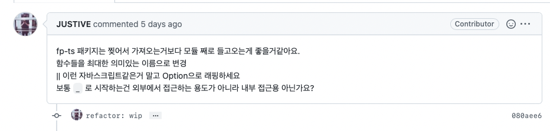
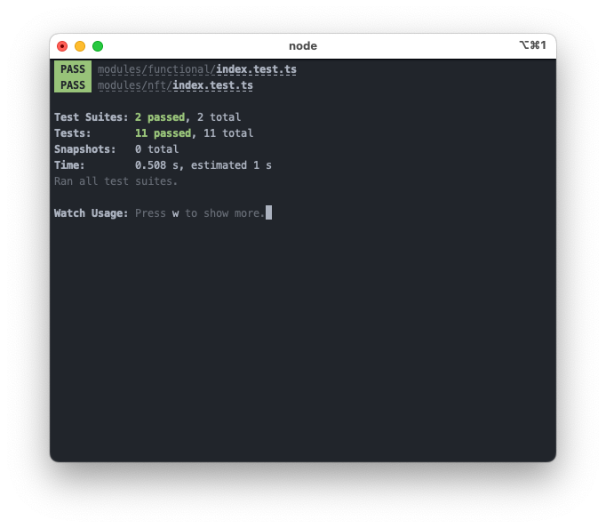

안녕하세요. 저는 개발하는 뭐시깽이인 나비라고 합니다.

이번시간에는 아는 지인이 열렬하게 영업하고 사랑하는 함수형 프로그래밍을 fp-ts 라는 라이브러리로 구현해보고자 합니다.


## TL;DR

* 레포지토리 : [kimpinot/functional-programming](https://github.com/kimpinot/functional-programming)
* 사실 TDD는 필요 없습니다. **'타입이 있는데 왜 테스트를 하죠?'**
  * 하지만 저는 로직의 순수성을 보장하기 위해 TDD를 사용했습니다.

* 전체 코드는 아래와 같습니다.

```typescript filename="all.ts"
import { TokenMeta as Meta, TokenVisible as Visible } from "constants/database";
import { Numeric } from "../types";
import { pipe } from "fp-ts/lib/function";
import * as Array from "fp-ts/Array";
import * as String from "fp-ts/string";
import * as Ord from "fp-ts/Ord";
import * as Option from "fp-ts/Option";

export type TokenInfo = Visible &
  Meta & {
    _id: Numeric;
  };
type Info = TokenInfo;
export type NumericMap<T> = Map<Numeric, T>;
export type MappedVisible = NumericMap<Visible>;
export type MappedInfo = NumericMap<Info>;

export const visibleArrToMap = (visible: Visible[]) => new Map(visible.map((x) => [x.nftTokenId, x]));

export const defaultVisible = (nftTokenId: Numeric): Visible => ({
  id: "-1",
  nftTokenId,
  order: "0",
  isHidden: "false",
});

export const visibleFromMap = (v: MappedVisible) => (nftId: Numeric) =>
  pipe(v.get(nftId), Option.of, Option.getOrElse(defaultVisible(nftId)));

export const visibleObject =
  (v: MappedVisible) =>
  (m: Meta): Info => ({
    _id: m.id,
    ...m,
    ...visibleFromMap(v)(m.nftTokenId),
  });

export const mergeMetaWithVisibleMap =
  (m: Meta[]) =>
  (v: MappedVisible): Info[] =>
    pipe(m, Array.map(visibleObject(v)));

const isHidden = (item: Info) => item.isHidden === "false";
export const keepNonHidden = (items: Info[]) => pipe(items, Array.filter(isHidden));

const sortByOrder = pipe(
  String.Ord,
  Ord.reverse,
  Ord.contramap((item: Info) => item.order),
);
export const sortItemsByItsOrder = (items: Info[]) => pipe(items, Array.sort(sortByOrder));

export const all = (meta: Meta[]) => (visible: Visible[]) =>
  pipe(visible, visibleArrToMap, mergeMetaWithVisibleMap(meta), keepNonHidden, sortItemsByItsOrder);
```


## 목표 만들기

목표는 최근에 가장 골머리를 앓았던 **아래 타입을 가진 배열 A와 B가 있을 때 조건에 따라 정렬 및 필터하기** 로 하도록 하겠습니다. 근데 이제 함수형을 곁들인...

### 타입 정의

```typescript
export type TokenMeta = {
  id: `${number}`;
  nftTokenId: `${number}`;
  title: string;
  createdAt: `${ReturnType<Date["toISOString"]>}`;
};

export type TokenVisible = {
  id: `${number}`;
  nftTokenId: `${number}`;
  isHidden: `${boolean}`;
  order: `${number}`;
};

const A: TokenMeta[] = [];
const B: TokenVisible[] = [];
```

### 조건 정의

* `TokenMeta` 와 `TokenVisible` 은 공통의 속성을 가지는 `nftTokenId` 라는 값을 기준으로 합쳐져야 한다.
* `TokenMeta` 와 `TokenVisible` 의 관계는 one-to-many 관계다.
* 짝이 맞는 `TokenMeta` 와 `TokenVisible` 이 없을 경우가 생길 경우 다음과 같이 처리한다.
  * `TokenMeta` 가 없는 경우 : `TokenVisible` 타입의 가상의 더미를 만든다, 이때 `order` 는 `"0"`, `isHidden`은 `"false"` 여야 한다.
  * `TokenVisible` 이 없는 경우 : 해당 TokenVisible을 숨김처리한다.
* 합쳐진 `TokenMeta` 와 `TokenVisible` (이하 `TokenInfo`) 는 `isHidden` 이 `"true"` 일 경우, 숨김처리 되어야 한다.
* `TokenInfo` 는 `order` 값을 기준으로 역방향 정렬이 되어야 한다.


## 테스트 코드 짜기

우선 목표가 정의되었으니 테스트코드를 짤수 있게 되었습니다. (야호)

```typescript
describe("merge", () => {
  it("It defined!", () => {
    expect(typeof merge).toBe("function");
  });

  it("It works!", () => {});
});

describe("filter", () => {
  it("It defined!", () => {
    expect(typeof filter).toBe("function");
  });

  it("It works!", () => {});
});

describe("sort", () => {
  it("It defined!", () => {
    expect(typeof sort).toBe("function");
  });

  it("It works!", () => {});
});

describe("all", () => {
  it("It defined!", () => {
    expect(typeof all).toBe("function");
  });

  it("It works!", () => {});
});
```

...

뭐 어때요? 일단 테스트가 추가되긴 했잖아요?

### merge 하는 부분 테스트 코드 짜기

```typescript
describe("merge", () => {
  it("should defined function", () => {
    expect(typeof merge).toBe("function");
  });

  it("works with normal case", () => {
    expect(
      pipe()
    ).toStrictEqual(
      __mocked_merge_info__,
    );
  });
});
```

### filter 하는 부분 테스트 코드 짜기

```typescript
describe("filter", () => {
  it("should be include isHidden=false item", () => {
    expect(filter(__mocked_token_info__).some((item) => item.isHidden === "true")).not.toBeTruthy();
    expect(filter(__mocked_token_info__).some((item) => item.isHidden === "false")).toBeTruthy();
  });

  it("should be exclude isHidden=true item", () => {
    expect(filter(__mocked_token_info__).some((item) => item.isHidden === "false")).toBeTruthy();
    expect(filter(__mocked_token_info__).some((item) => item.isHidden === "true")).not.toBeTruthy();
  });
});
```

* isHidden이 false 인 코드만 있는지 확인합니다
* isHidden이 true 인 코드만 있는지 확인합니다.

이 글을 쓰면서 다시 생각하는건데, true 또는 false 이외의 값이 들어간 케이스도 더 들어갔으면 좋았을거 같네요.

```typescript
it("should be exclude invalid isHidden value", () => {
  expect(filter(__mocked_token_info__).some((item) => item.isHidden !== "true")).not.toBeTruthy();
});
```

### sort 하는 부분 테스트 코드 짜기

```typescript
describe("sort", () => {
  it("should be sorted first item order is 30", () => {
    expect(sort(__mocked_token_info__)[0].order).toBe("30");
  });

  it("should be sorted last item order is 0", () => {
    expect(sort(__mocked_token_info__)[4].order).toBe("0");
  });
});
```

* 정렬을 마치면 첫번째 아이템의 order는 30이 될것이고 (최고값) 이 값을 찾습니다.
* 마지막 아이템의 order는 0이여야 합니다.

이 부분도 글 쓰면서 다시 보니까 하드코드된 부분이 많아서 테스트케이스가 추가되었을 때 테스트가 망가질 위험이 있어보입니다. 이렇게 수정해보겠습니다.

```typescript
describe("sort", () => {
  it("should be sorted first item order is 30", () => {
    // 가장 높은 order 값을 반환하는 함수
    const highestOrder = __mocked_token_info__.reduce(
      (prev, cur) => (Number(prev) < Number(cur.order) ? cur.order : prev),
      "0",
    );
    // 첫번째 아이템은 가장 높은 Order 값을 가져야 한다
    expect(sort(__mocked_token_info__)[0].order).toBe(highestOrder);
  });

  it("should be sorted last item order is 0", () => {
    // 가장 낮은 order 값을 반환하는 함수
    const lowestOrder = __mocked_token_info__.reduce(
      (prev, cur) => (Number(prev) > Number(cur.order) ? cur.order : prev),
      "0",
    );
    const sorted = sort(__mocked_token_info__);
    // 마지막 아이템의 order 값은 가장 낮아야 한다
    expect(sorted[sorted.length - 1].order).toBe(lowestOrder);
  });
});
```


## 함수형으로 코드짜기

### Merge

```typescript
import { pipe } from "fp-ts/lib/function";
import { map } from "fp-ts/lib/Array";

export const visibleArrToMap = (visible: Visible[]) => visible.reduce((map, cur) => map.set(cur.nftTokenId, cur), new Map() as MappedVisible);

const defaultVisible = (nftTokenId: Numeric): Visible => ({
  id: "-1",
  nftTokenId,
  order: "0",
  isHidden: "false",
});

const getVisible = (v: MappedVisible) => (nftId: Numeric) => v.get(nftId) || defaultVisible(nftId);

const generateVisible =
  (v: MappedVisible) =>
  (m: Meta): Info => ({
    _id: m.id,
    ...m,
    ...getVisible(v)(m.nftTokenId),
  });

export const merge =
  (m: Meta[]) =>
  (v: MappedVisible): Info[] =>
    pipe(m, map(generateVisible(v)));
```

`merge` 함수는 `nftTokenId` 값을 기반으로 `TokenVisible`와 `TokenMeta`를 합치는 함수입니다.

위 정의에서 **TokenMeta와 TokenVisible은 one-to-many이다** 라는 전제가 있었으니, `visibleArrToMap` 함수를 사용하여 더 쉽게 값을 찾을 수 있도록 했습니다.

만약 **TokenVisible 이 없을 경우에는** 더미 TokenVisible을 만들어 TokenMeta에 TokenVisible이 들어가지 않는 끔찍한 일을 막도록 했습니다.

근데 쓰면서 생각하는데 `TokenMeta`, `TokenVisible` 너무 기네요 앞으로는 `Meta` 와 `Visible` 로 부르도록 하겠습니다.

### Sort & Filter

```typescript
export const sort = (items: Info[]) => items.sort((prev, next) => Number(next.order) - Number(prev.order));
export const filter = (items: Info[]) => items.filter((item) => item.isHidden === "false");
```

사실 이 코드까지는 도저히 함수형으로 어떻게 만들어야 할지 몰라서 일단은 슈퍼짱안함수형 타입의 코드로 작성했습니다.

조금 있다가 리팩토링 할거니 안심하고... 우선 코드를 계속 짜보도록 합시다.

### All

```typescript
import { pipe } from "fp-ts/lib/function";

export const all = (meta: Meta[]) => (visible: Visible[]) => pipe(visible, visibleArrToMap, merge(meta), filter, sort);
```

이 슈퍼짱함수는 엄청 간단한데, 그냥 지금까지 있는 기능들을 하나로 디지몬 합!체 한다는 느낌입니다.

그래서 그 무엇보다 엄청 간단하죠 짱


## 리팩토링하기

근데 이렇게 코드를 짜니까 너무 아쉬운 부분이 많이 보입니다.

특히 sort와 filter가 함수형이 아니라 내장 함수인게 엄청 아쉬웠습니다.

### Sort

```typescript
import { pipe } from "fp-ts/lib/function";
import { sort as _sort } from "fp-ts/lib/Array";
import { Ord } from "fp-ts/lib/string";
import { contramap, reverse } from "fp-ts/lib/Ord";

const sortByOrder = pipe(
  Ord,
  contramap((item: Info) => item.order),
  reverse,
);
export const sort = (items: Info[]) => pipe(items, _sort(sortByOrder));
```

`fp-ts/string` 에는 정렬에 대한 연산을 해주는 `Ord` 라는 함수가 있습니다.

그리고 `contramap` 이라는 이름의 특정 조건이 주어지면 정렬 연산을 해주는 함수가 있는데요.

이 두개를 합치면 무슨일이 일어날까요?

의사코드로 쓰면 대략 이런 코드가 나오게 됩니다.

```text
정렬((item) => item.order 의 값을)(String 정렬)
위 값을 뒤집기 
```

`contramap` 을 정렬로, `Ord` 를 String 정렬로, `reverse` 를 뒤집기로 치환하면 제가 작성한 코드가 됩니다.

### Filter

심지어 filter는 더 간단합니다.

```typescript
import { pipe } from "fp-ts/lib/function";
import { map, filter as _filter } from "fp-ts/lib/Array";

const isHidden = (item: Info) => item.isHidden === "false";
export const filter = (items: Info[]) => pipe(items, _filter(isHidden));
```

진짜 이게 끝이에요. true 또는 false를 반환하는 함수를 인자로 쥐어주면 빠르게 코드를 작성할 수 있다니...

솔직히 이거를 본 순간 '아 함수형이 좀 짱이네...ㅎ' 라는 생각을 하게 되었습니다.


## PR로 받은 리팩토링 적용하기

원래는 여기까지 글을 쓰고 블로그에 게시하려고 했지만...



세상에나.

함수형을 배우는데 지대한 도움을 주셨던 킹갓엠페러충무공지인분께서 선물과도 같은 PR이 도착했습니다.

한번 살펴보죠.

자세한 PR 전문은 [여기](https://github.com/KimPinot/functional-programming/pull/1/commits/080aee64199176089ee8372c9e20692b2053b662) 에서 볼 수 있습니다.

### 함수는 모듈째로 가져오는게 더 좋을지도?

```tsx
// import { map, filter as _filter, sort as _sort } from "fp-ts/lib/Array";
// import { Ord } from "fp-ts/lib/string";
// import { contramap, reverse } from "fp-ts/lib/Ord";
import * as Array from "fp-ts/Array";
import * as String from "fp-ts/string";
import * as Ord from "fp-ts/Ord";
```

사실 이거는 조금 고민이긴 한데, fp-ts 라이브러리 상에서 기능은 다르지만 겹치는 함수의 이름이 왕왕 있기 때문에 이렇게 하라고 어드바이스를 주셨습니다.

생각해보니

### 함수의 이름은 최대한 직관적으로

```typescript
// export const merge =
export const mergeMetaWithVisibleMap =
```

```typescript
// export const filter = (items: Info[]) => pipe(items, _filter(isHidden));
export const keepNonHidden = (items: Info[]) => pipe(items, Array.filter(isHidden));
```

```typescript
// export const sort = (items: Info[]) => pipe(items, _sort(sortByOrder));
export const sortItemsByItsOrder = (items: Info[]) => pipe(items, Array.sort(sortByOrder));
```

### Map을 만들때에는 그냥 배열을 넣자

```typescript
// export const visibleArrToMap = (visible: Visible[]) => visible.reduce((map, cur) => map.set(cur.nftTokenId, cur), new Map() as MappedVisible);
export const visibleArrToMap = (visible: Visible[]) => new Map(visible.map((x) => [x.nftTokenId, x]));
```

세상에나 이렇게 쓸수 있던 코드를 왜 저는 저렇게 썼던걸까요? 코드를 썼던 그때의 저는 사라졌으니 앞으로는 Map 객체를 만들때에는 인자로 배열을 넣어야 한다 라고 지금의 저에게 가르쳐야할것 같습니다.

### || 연산자 대신 `Object.fromNullable`

```typescript
// export const visibleFromMap = (v: MappedVisible) => (nftId: Numeric) => v.get(nftId) || defaultVisible(nftId);
export const visibleFromMap = (v: MappedVisible) => (nftId: Numeric) => pipe(v.get(nftId), Option.fromNullable);

// export const visibleObject =
//  (v: MappedVisible) =>
//  (m: Meta): Info => ({
//    _id: m.id,
//    ...m,
//    ...visibleFromMap(v)(m.nftTokenId),
// });
export const visibleObject =
  (v: MappedVisible) =>
  (m: Meta): Info =>
    pipe(visibleFromMap(v)(m.nftTokenId), Option.getOrElse(defaultVisible(m.nftTokenId)), makeToken(m.id)(m));
```

`Object.fromNullable` 함수는 반환되는 함수가 null 이거나 undefined 일 경우 None을 반환하는 함수인데요.

`visibleObject` 함수에 `Object.fromNullable ` 를 파이프로 연결함으로써 `v.get(nftId)` 에서 undefined 타입이 리턴되지 않게 만들게 되었습니다.


## 완성!



결과적으로, 기능도 잘 동작하면서 간결하고 타입 정의도 명확한 함수를 만들어냈습니다 (야호)

이제 남은것은 실제로 사용하는 것 뿐입니다.

### 느낀점

솔직히 처음에는 Jest를 사용한 테스트 생성도, 함수형이라는 개념도 전부 생소해서 어려웠지만, 이 글을 쓰는 지금은 함수형이랑 조금 더 친해진 것 같습니다. 시간 날때마다 짬짬히 이렇게 만들다보면 언젠가는 더 좋은 코드를 쓸 수 있지 않을까요?

### 다음 목표...?

아마 다음 목표는 테스트 주도 개발로 유저의 정보를 가져오는 간단한 CRUD 어플리케이션을 만들까 합니다.

그럼 언제가 될지 모르겠지만 우리 또 만나요!