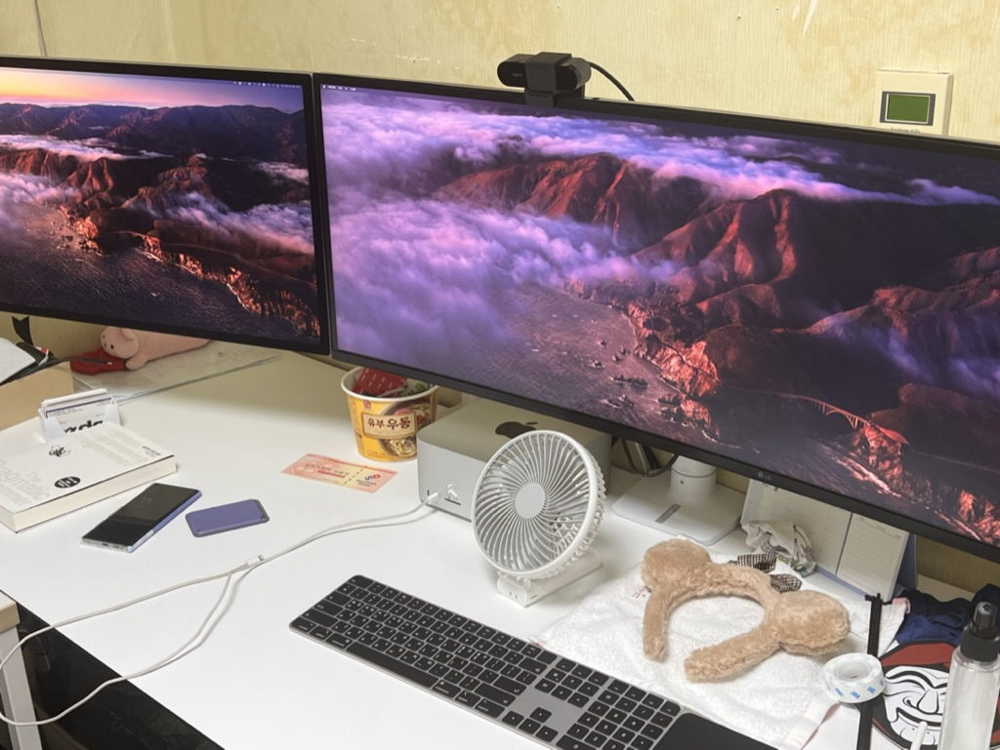
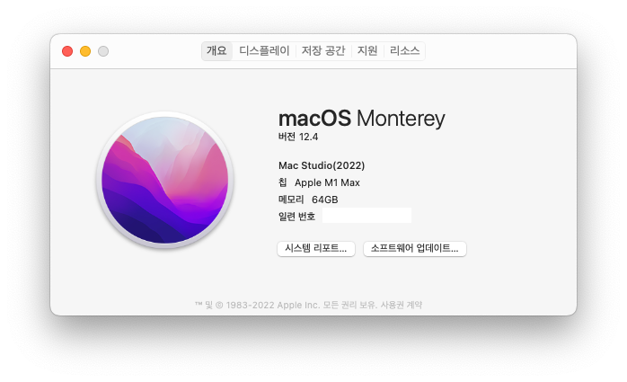
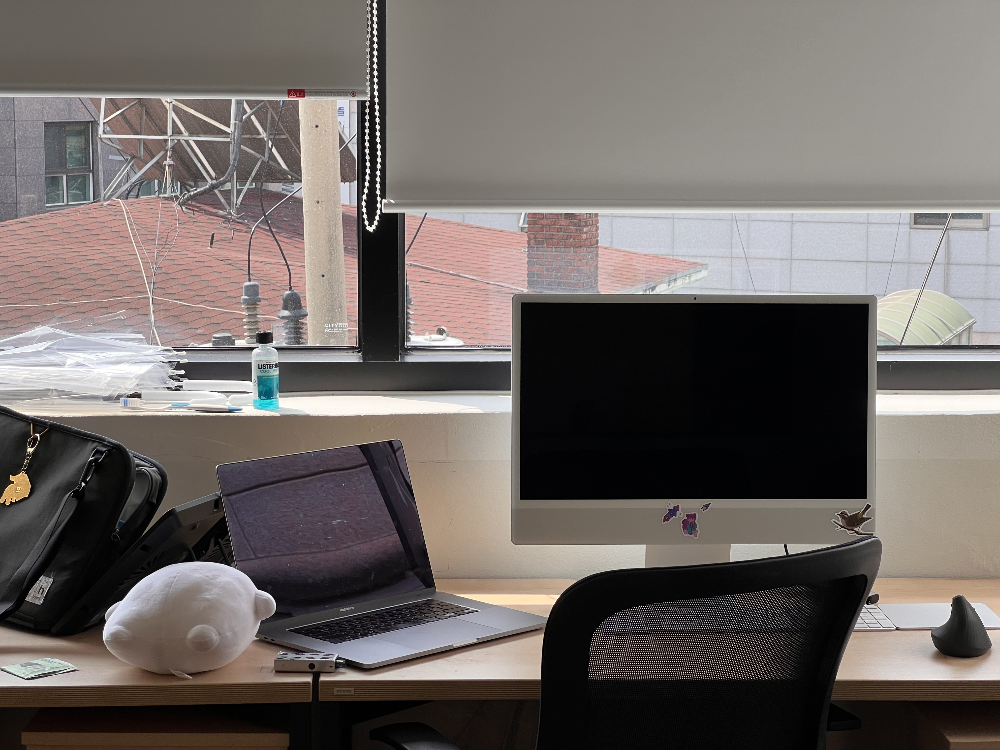
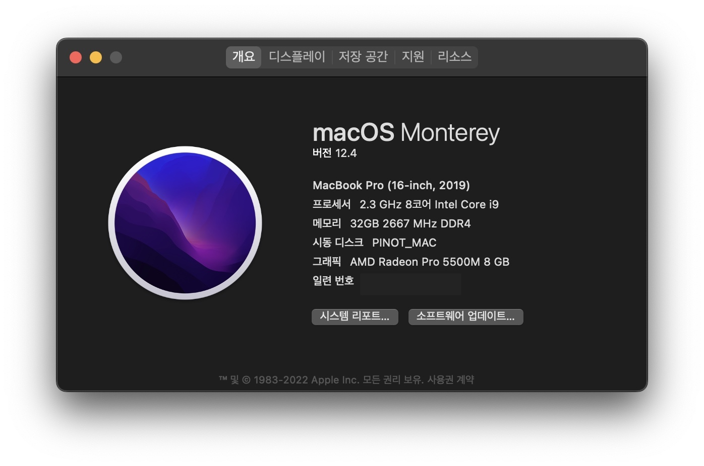

장비는 있는데 왜 유비는 없냐고 말한 저의 친애하는 트친에게 이 글을 안바칩니다

안녕하세요. 저는 프론트엔드 개발을 하고 있는 나비라고 합니다.
이번에는 제가 사용하는 장비와 이 장비를 어떤 이유로 사용하게 되었는지에 대해서 조금 적어보는 시간을 가지고자 합니다.

## 집에서 사용하는 장비

보통 집에서는 개인적인 프로젝트 개발을 주로 하는데요, 코로나 19 이후로 재택근무가 많아짐에 따라 남는 돈을 모두 집에 있는 장비에 쏟게 되었습니다.

근데 정작 지금은 회사로 출근을 많이 하고 있어서 자주 사용하지 못한다는 점은 조금 슬프네요 🥲

### 메인 컴퓨터 : 맥 스튜디오 (2022)

이전에 사용하던 M1 아이맥의 램이 너무 아쉬워서 벼르고 있다가 바로 구매했었던 기억이 있습니다.

M1 Max 32코어 GPU, 64GB 통합 메모리, 2TB CTO 사양으로 구매했습니다.

가격이 비싸다는 단점을 제외하면 모난곳 없는 최고의 맥이라고 자부할 수 있습니다.

아무리 어렵고 힘든 작업을 돌려도 언제나 차가운 온도를 유지하는... 신기한 물건입니다.

**이런점이 좋았습니다.**

* 아무리 힘든 작업을 굴려도 따뜻해지지 않는 신기한 열처리
* 울트라슈퍼빠른성능

**이런점이 아쉬웠습니다.**

* 가격, 가격, 가격 무엇보다 가격이 문제입니다.

### 모니터 (오른쪽) : LG 49인치 모니터 (49WL95CW)

가장 많이 사용하는 49인치 모니터입니다. 당시에 기본 M1칩을 탑재한 아이맥의 경우 외장 모니터가 1개 이상 지원되지 않았기 때문에 트리플모니터 환경을 구성하고 싶었던 당시의 저에게 최적의 선택지였습니다.

이전에는 Dell에서 나온 U4919DW를 사용했었지만, 모니터암을 설치하던 도중 패널을 부숴서 쿠퐝에서 급하게 구매했었던 쓰라린 기억도 가지고 있습니다.

**이런점이 좋았습니다.**

* 32:9 비율의 광활한 모니터 비율

**이런점이 아쉬웠습니다.**

* 모니터암 찾기가 너무 힘들었습니다.
* U4919DW 처럼 패널이 망가지면 전체를 수리해야 합니다.

### 모니터 (왼쪽) : 스튜디오 디스플레이 (2022)

스튜디오를 같이 구매하면서 구매했습니다. LG의 울트라파인과 최후의 최후까지 고민했으나, 좋은 품질의 스피커와 센터스테이지가 되는 웹캠 기능이 제 마음을 끌어 구매했습니다. 더 밝아진 화면 밝기도 한몫 했고요.

* 구매할 때 기본, 위아래 스탠드, 베사홀 버전이 있었는데 모니터암에 올리기 위해서 베사홀 버전을 선택했습니다.
* 뒤에 있는 조명에서 빛이 반사되는것이 싫어서 나노 텍스처 글래스(팀쿡 사포질 에디션)을 선택했습니다.

**이런점이 좋았습니다.**

* P3 99%의 정확한 색영역
* M1 아이맥에서는 안되는 센터 스테이지

**이런점이 아쉬웠습니다.**

* 매우 비싼 가격 (모니터에 200을 태워야 합니다)

### 모니터암 1 : 어고트론 HX 45-475-026

49인치 모니터를 데스크에 올리기 위해 구매했습니다.

이전에는 카멜마운트의 고든을 사용했는데, 가격에 비해 마감이 좋다고 느끼지도 않았고 틸트가 계속 흘러내려서 새로 구매했습니다.
틸트, 높이 고정도 잘해주고 제가 원하는대로 잘 움직여줘서 만족하면서 사용하고 있습니다.

**이런점이 좋았습니다.**

* 모니터암에서 기대하는 기본적인 성능을 다 함

### 모니터암 2 : 카멜마운트 CA-2

스튜디오 디스플레이를 연결하기 위해 구매했습니다.

더욱 좋거나, 부족한곳도 없는 정말로 무난한 모니터암입니다.

**이런점이 좋았습니다.**

* 현재 장력을 바로 파악할 수 있는 인디케이터가 있다

### 키보드 : Magic Keyboard with Touch ID and Numeric Keypad (Black)

M1 아이맥에서 터치아이디를 사용한 로그인 경험이 좋았어서, 맥 스튜디오에서도 터치아이디를 사용하기 위해 구매한 키보드입니다.

숫자를 많이 입력하는 특성 상 풀사이즈 배열의 키보드를 구매했습니다.

**이런점이 좋았습니다.**

* 터치아이디가 된다!
* 108키가 된다!

**이런점이 아쉬웠습니다.**

* 키보드 높이가 너무 낮아서 다른 키보드 적응이 안된다

### 트랙패드 : Magic Trackpad (Black)

쓸어올리기, 상하좌우 스크롤, 핀치 인-아웃 같은 제스처를 더욱 편하게 사용하기 위해 구매했습니다.

키보드, 마우스와 색깔을 맞췄습니다.

**이런점이 좋았습니다.**

* 전부다 만족할 퀄리티

### 마우스 : MX Master 3 for Mac

1년정도 사용한 MX Master 3 for Mac 입니다. 유니파잉, 블루투스 모두 지원하며 특히 맥에 좋은 궁합을 가지고 있습니다.

Logi Options+ 를 사용하면 다른 마우스에 비해 더 자세한 설정을 할 수 있어 계속 사용하고 있습니다.

**이런점이 좋았습니다.**

* Mac과 좋은 궁합을 가지고 있음
* 무한스크롤과 일반 스크롤의 토글이 빠름

**이런점이 아쉬웠습니다.**

* 딸깍딸깍하는 클릭소리
* 내가 지금 어떤 컴퓨터에 연결했는지 확인이 바로 불가능함

### 모션데스크 : 베스트피스 Mattz 데스크

가격은 비싸지만 아주 잘 사용하고 있는 모션데스크입니다.

* 상판 소재가 고급진 페닉스 소재를 사용하고 있어 흠집이나 지문에 강한것이 특징이고, 두께가 얇은것이 특징입니다.
* 방의 너비가 조금 좁아서 1800 * 700 사이즈로 주문제작을 했었습니다.
* 100cm에서도 크게 흔들림이 없었고, 전반적으로 만족하고 있는 제품입니다.

**이런점이 좋았습니다.**

* 소재, 퀄리티, 흔들림 이 모든것이 완벽했습니다.
* 기사님의 방문설치로 구경만 하면 됩니다.

**이런점이 아쉬웠습니다.**

* 이 모든것을 이루어내기 위한 매우 비싼 가격

### 의자 : 허먼밀러 에어론 풀 체어 + 아틀라스 헤드레스트

허먼밀러입니다. 더 말이 필요 없습니다.

### 웹캠 : 로지텍 BRIO 4K

스튜디오 디스플레이의 센터스테이지가 좋긴 했지만, 왼쪽으로 붙어버리는 모니터의 위치로 인해 제 얼굴이 정면으로 보이지 않는 자잘한 이슈가 있었고, 이를 해결하기 위해 구매한 4K 웹캠입니다.

사실 그 외에도 웹캠을 사용해서 이것저것 하기 위해서도 필요했기 때문에 구매했었습니다.

**이런점이 좋았습니다.**

* 4K 화질을 가지고 있음
* C to C 케이블이 있음

### 시계 : Apple Watch 6 (Red)

집에서 수면 시간 트래킹을 위해서 사용하고 있습니다.

원래는 밖에서 사용할 용도로 구매했었지만, 애플워치 7을 구매하면서 그렇게 쓸모가 없어졌습니다.

**이런점이 좋았습니다.**

* 전반적으로 만족하는 성능

## 회사에서 사용하는 장비

회사에서는 크게 장비에 투자를 하지 않고 집에서 사용하던 장비를 그대로 가져와서 사용하고 있습니다.

근데 허리가 조금씩 아파져서 돈이 남는대로 허먼밀러를 구매할 생각입니다.

### 메인 컴퓨터 : 아이맥 24인치 (2021)

M1칩이 달린 아이맥 24인치 모델입니다.

8코어 GPU, 16GB 통합 메모리, 1TB SSD 옵션으로 주문했었습니다.

구매 이후 집에서 사용하다가 맥 스튜디오 도착 이후에는 회사로 옮겨져 계속 고생하고 있습니다.

**이런점이 좋았습니다.**

* 애플 제품군은 언제나 저를 실망시키지 않았습니다.

**이런점이 아쉬웠습니다.**

* 센터 스테이지가 안됨
* 외장 모니터를 1개 이상 연결할 수 없음

### 키보드 / 트랙패드 : Magic Keyboard with Touch ID and Numeric Keypad + Magic Trackpad

아이맥 사면 기본으로 주는 키보드 사양을 업그레이드 했습니다.

집에서와 똑같은 세팅으로 사용하고 있습니다.

### 마우스 : MX Master 3S

사진에 있는 마우스가 아닙니다 🥲

MX Master 3 for Mac의 후속작입니다. 가장 많이 바뀐 점은 마우스 스위치가 무소음으로 바뀌어 클릭할때 소리가 나지 않는다는 점이 특징입니다.

그 이외에는 전작과 비슷합니다.

**이런점이 좋았습니다.**

* MX Master 3 for Mac을 베이스로 디테일한 부분을 바꿨습니다.
* 무소음 스위치가 적용되어 소리가 들리지 않습니다.

**이런점이 아쉬웠습니다.**

* MX Master 3 for Mac에 비해 크게 바뀐게 없습니다

## 항상 들고다니는 장비

가방이나 캐리어에 항상 넣고다니는 물건들입니다.

급한 이슈가 생겼을 때 그 자리에서 빠르게 대응할 수 있도록 하는것이 목표로 선정했습니다.

### 메인 핸드폰 : iPhone 13 Pro

예전에 다니던 회사에서 선물로 받은 아이폰 13 프로입니다.

그때 당시에 1TB 모델만 매장에 재고가 남아있어서 급하게 달려가 구매했던 기억이 있습니다.

다음 핸드폰은 꼭 512GB로 구매할 예정입니다.

**이런점이 좋았습니다.**

* 애플 제품군은 딱히 아쉬운게 없습니다.

**이런점이 아쉬웠습니다.**

* 1테라 사지 말껄

### 서브 핸드폰 : 갤럭시 노트 10 5G

회사 유심에 물려두고 사용하고 있는 갤럭시 노트 10입니다.
통화 녹음이 아이폰에서는 되지 않아서 알뜰폰으로 개통했었는데, 메인 핸드폰이 뻗거나 SKT 통화 품질이 안좋아질 때 스페어로 열심히 사용중입니다.
삼성페이 짱

**이런점이 좋았습니다.**

* 삼성페이
* 마지막으로 남은 순정 12GB 메모리
* 짱이쁨

**이런점이 아쉬웠습니다.**

* 안드로이드가 너무 느려요

### 헤드셋 : Airpods Max

애플 제품을 모두 산 사람이 살게 없을때 구매한다는 에어팟 맥스입니다.

에어팟 프로가 막지 못하는 노이즈캔슬링을 더욱 보강하기 위해서 구매했고, 생각보다 엄청 만족하면서 사용하고 있습니다.

**이런점이 좋았습니다.**

* 엄청난 수준의 노이즈캔슬링
* 애플과의 뛰어난 연동성

**이런점이 아쉬웠습니다.**

* 그돈이면 소니 WX 헤드셋을 살 수 있음
* 무거움

### 시계 : Apple Watch 7 Hermes Edition

지인이 생각보다 싼 가격에 셀룰러 애플워치 7을 팔아서 오 하면서 구매했더니 에르메스 에디션이였습니다 (각색 있음)

가죽줄이 고급스럽긴 한데, 구멍이 자꾸 늘어나는 것 같아서 고민입니다. 수선 되겠지...?

**이런점이 좋았습니다.**

* 에르메스 에디션이여서 멋짐
* 베젤 사이즈가 조금 줄음

**이런점이 아쉬웠습니다.**

* 애플워치 6랑 비슷하게 생김

### 메인 컴퓨터 : Macbook Pro (2019, 16-inch)

마지막 16인치 인텔 맥입니다. 중고로운 평화나라에서 300만원에 애플케어 포함해서 구매했었는데, 13인치 M1이 나올줄 알았다면 조금만 기다릴껄... 이라는 후회는 있습니다.

중고로 팔까도 고민했지만, 인텔맥의 부트캠프를 기반으로 해야 할 일들이 있어 팔리지 않고 잘 살아가고 있습니다.

**이런점이 좋았습니다.**

* 마지막 남은 인텔 맥이라 부트캠프가 됩니다
* 터치바가 있습니다

**이런점이 아쉬웠습니다.**

* 이거 빼고 전부 다

### 아이패드 : iPad Mini (6세대)

작고 소중한 아이패드 미니입니다.

애플케어의 가호를 믿고 막 굴리면서 사용하는 중입니다.

간단하게는 전자책 읽기부터 복잡하게는 큰 규모의 코드리뷰를 하는데 사용하고 있습니다.

**이런점이 좋았습니다.**

* 작고 귀여움
* 크기에 비해서 활용 방법이 많음

## 끝?

'장비에만 중고차 한대 정도를 투자했겠네'~~ 라는 생각은 하고 있었는데 막상 직접 계산해보니 정말로 차 한대가 나와서 조금 놀라웠습니다.

이거 이외에도 다른 장비들도 있지만, 시간과 지면 관계상 담지 못했습니다.

장비에 관련된 궁금증이나, 이런 장비가 좋아요! 같은 영업은 댓글로 부탁드립니다 :)...
