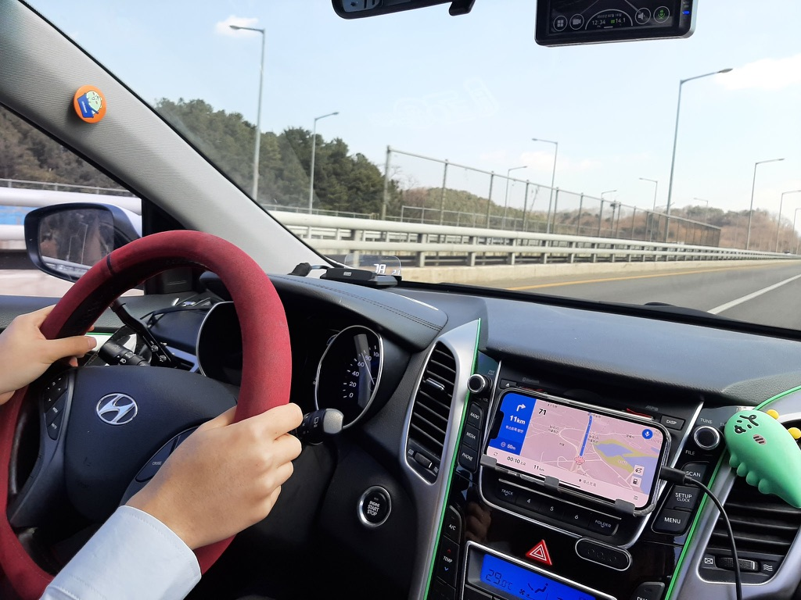

# 목표

[2022년의 목표](//nabi.kim/2022년의-목표/) 에 분기별로 회고록을 작성해보고자 스스로 약속을 했었는데, 회사 일로 바빠서 정신을 못차리다가 겨우 여유가 나서 회고를 작성해본다.

개인적으로 이룬 성취부터, 개발자적으로 이룬 성취까지 적어보고자 한다.

# 무엇을 이뤘나요

올해 만든 목표중에서 뭐를 이뤘는지 정리해보았다.

## 오픈소스에 작게나마 기여하기

식탁보 프로젝트라고 윈도우의 샌드박스 기능을 사용해서 공인인증서 같은 화가 나는 프로그램들을 내 컴퓨터에 직접 설치하지 않아도 사용할 수 있도록 도와주는 서비스가 있다.

최근에 [경기도 청소년 교통비 지원 포털](https://www.gbuspb.kr/userMain.do) 에서 교통비를 신청할 일이 생겼는데, 여기서 설치해야 하는 프로그램 카탈로그를 추가하는 기능을 PR했다. ([yourtablecloth/TableClothCatalog#3](yourtablecloth/TableClothCatalog#3))

결과적으로 성공적인 오픈소스 기여를 완료했다 (만세!)

## 블로그에 이상한 기능들 추가하기

블로그를 Hexo로 이전하면서 제일 먼저 생각했던 것은 '이상한 기능들을 많이 추가하자' 였다.

다른 기술 블로그에서 보지 못할 법한 기능들을 마개조 해서 넣어보자! 라는 원대한 꿈이였는데, 최근에 CV를 블로그로 이전시키는 작업을 하면서 이 목표를 이루게 되었다.

마크다운상에서는 또 HTML 태그가 먹지 않아서 언럭키 [mdx](https://mdxjs.com) 느낌으로 마크다운 파일 안에 HTML 태그를 적절히 넣어서 이력이 숨겨지거나 펼쳐지는 기능을 가진 독특한 구조의 CV가 세상에 만들어졌다.

이걸 하면서 제일 먼저 고려한 것은 **이 페이지를 프린터로 인쇄했을 때에도 일관적인 디자인 패턴을 보여줄 것** 이였는데, CSS에 `@media print` 쿼리를 사용해서 프린터 환경에서 다른 UX를 가질 수 있도록 노력했다.

## 1000만원 모아보기

솔직히 이거는 쓰면서도 '에이 설마 되겠어 ㅋㅋ' 하는 마음가짐으로 쓴 내용이였다.

그리고 이 글을 쓰고 얼마 지나지 않아 여러 외주에 대한 정산이 들어오게 되면서...

1000만원이라는 큰 돈을 만져보게 되는 계기가 되었다.

그리고 이 돈은 허먼밀러나 모션데스크 같은 고가 장비와 가전제품으로 대체되었다는 조금 웃기지만 슬픈 이야기를 끝으로 넘기고자 한다.

## 회사에 입사해서 학교랑 MOU 맺기

예전부터 인연이 있던 [SCVSoft](https://scvsoft.net) 와 함께하기로 결정함으로써 우선 가장 큰 문제였던 회사 입사를 4월 첫날에 성공적으로 완료했다.

이제 학교와 MOU를 맺을지 말지에 대해서 고민을 해보고자 하는 위치에 서있다. 대략적으로 절반정도 온 것 같다.

# 목표 목록에는 없었지만 해낸 것들

위에꺼가 목표 목록에 있어서 해낸 것들이고, 그냥 해낸것들도 있다.

## 청소기 바꾸기

예전에 썼던 청소기는 쓸데없이 무거워서 청소를 한번 하려면 큰 다짐을 하고 청소했어야 했는데, 외주해서 번 돈으로 삼성 비스포크 제트라는 이름의 무선 청소기도 같이 샀다.

엄청 가볍고 또 흡입력도 생각보다 괜찮아서 잘 산거 같다고 생각하는 물건중 하나라고 생각중

## 자동차 운전하기

운전면허를 딴 기념으로 지인의 차를 빌려서 서울에서 양평까지, 양평에서 하남까지, 하남에서 집까지 셀프로 운전해봤다.

또 다른날에 만나서 이번에는 경부고속도로를 타고 대전까지 가보거나... 눈오는 밤에 청주에서 집까지도 운전해보는 강행군을 펼쳐보기도 했다.

다른 사람들은 운전할때 엄청 무섭다고 해서 처음에는 조금 무서웠는데 막상 해보니까 그렇게 어렵지도 않아서 다행이라고 생각하는 중.

## 마작하기

마작을 새롭게 시작했다. 평소에 자주 보던 옥냥이라는 스트리머가 하는걸 보고 에라 모르겠다~ 라는 심정으로 시작했는데...

생각보다 재미있고 또 한판 하기에도 편해서 하다보니 작사까지 달아버렸다. 여러분들도 재미있는 마작 하실래요?

# 기억에 남는 일들

## 모니터 박살내기

모션데스크에 맞는 모니터암을 새롭게 구매했는데, 49인치짜리 모니터를 떨어트려서 아래 사진처럼 화려하게 박살내버렸다.

수리를 할 수 있는지 물어봤는데 거의 새로 구매하는 가격이라 당일날에 LG 49인치 모니터를 또 구매했었다.

꼭 모니터와 같이 비싼 장비들을 다룰때는 안일하게 생각하지 말고 안전한 장소에 두는 습관을 가져보도록 하자.

## 카메라 사기

연습용이자 장난감으로 사용할 목적으로 올림푸스의 10년정도 더 넘은 E-520 모델을 당근에서 구매했다.

이걸로 이것저것 찍었는데 생각보다 재미있었다. 아마 다음에는 소니 A7M1 모델을 구매할 것 같다는 예감이 들고 있다.

# 다음 분기에는?

다음 분기에는 무엇을 해볼지 잘 모르겠지만, 그래도 열심히 살다보면 이런 재미있는 일들이 더욱 많이 생기지 않을까? 라는 생각이 들곤 한다.

따듯하고 정열적인 여름을 보낼 미래의 나에게 화이팅! 이라는 이야기를 전해주고 싶다.
