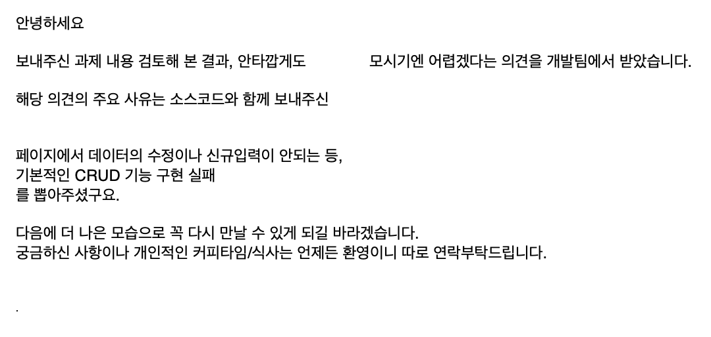
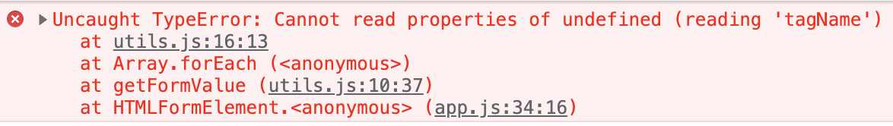
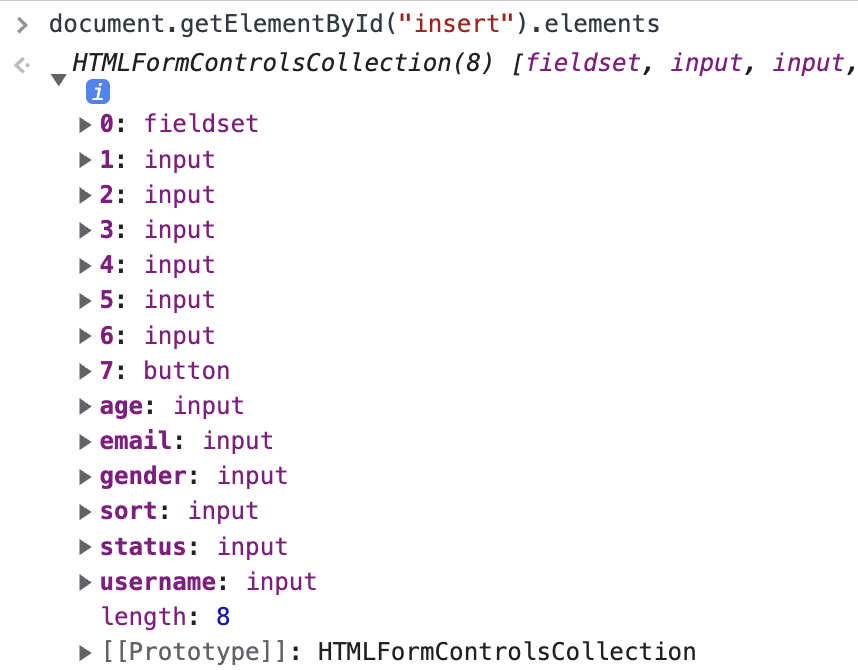
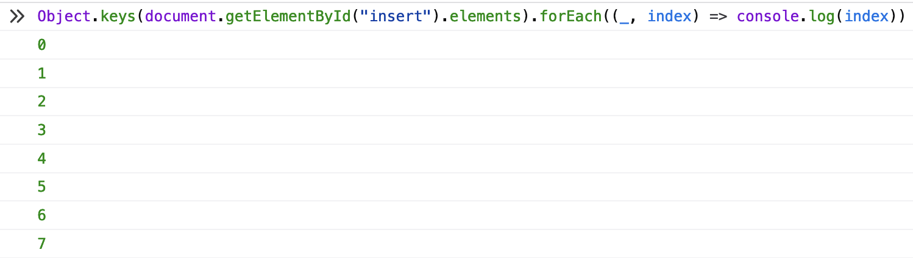
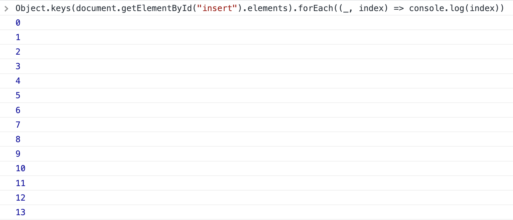
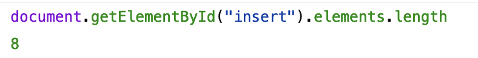
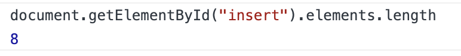
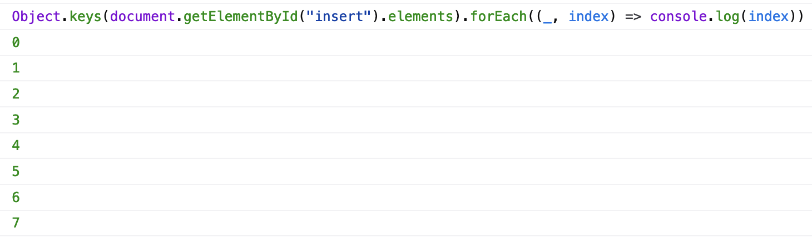
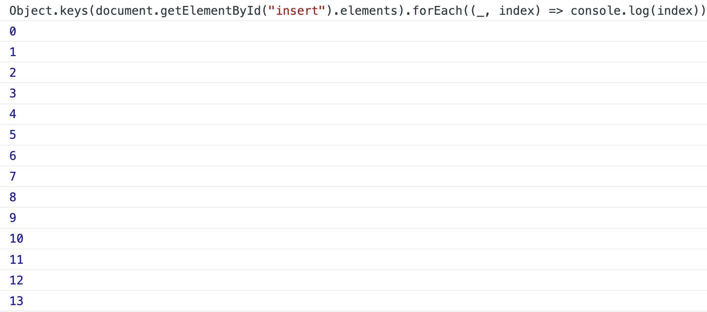
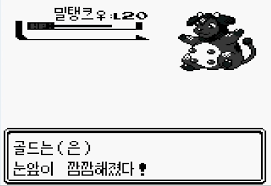

# 실무과제 불합격

지난달에 새로 회사에 지원했는데, 집으로 가는 길에 불합격 통보를 받았다.



기능이 정상적으로 CRUD가 동작하는것을 확인하고 제출했기에 '데이터의 수정이나 신규 입력이 안되는 등' 이라는 항목이 이해가 가지 않았다.

'??? 외않된데?' 이라는 생각으로 아이폰 Safari에서 링크를 열고 Form에서 데이터를 입력하고 버튼을 눌러본다. 동작하지 않는다.

'?????????' 이라는 생각으로 노트북에서 크롬을 실행시킨다. Form에 데이터를 입력하고 submit을 해본다. 오류가 뜬다.



무언가 잘못되었다.


# 과제의 내용

과제의 목표는 다음과 같았다.

* CRUD
* 사전에 주어진 csv 데이터를 포함해야 함
* 10개 단위의 페이지네이션
* onchange 검색 기능 구현
* 외부 라이브러리 사용 불가


# 구현 방법

확장성 ~~(실무 과제를 더 확장하는 상황은 쉽게 볼 수 없겠지만...)~~ 을 위해서 대부분의 기능들을 Model 이라는 class로 분리했다.

예를 하나 들자면, DOM과 관련된 기능 (`document.getElementById()`) 을 묶은 `DomModel` 이라는 이름의 class를 만드는 식이다.

여기서 더 나아가서 Model 단에서 state (게시판 데이터, 페이지네이션 인덱스) 등을 관리하도록 설정하기도 했다.

```js
class PaginationModel {
  // => state 관리
  page = 1;

  // => 데이터 init 및 이벤트 리스너 추가
  constructor() {
    (new DomModel()).find("index").addEventListener("change", (event) => {
      // => ...
    });
    (new DomModel()).find("index").value = String(this.page);
  }

  // => Model에서 사용하는 코드들, 보통은 DOM의 내용을 수정하는 등의 코드가 포함된다.
  /**
   * 컨텐츠를 새로고침 합니다.
   */
  #render() {
    Content.render(UserData.read(this.page - 1));
    (new DomModel()).find("index").value = String(Number(this.page));
  }

  // => Model 외부에서 사용하는 코드들
  /**
   * 첫번째 페이지를 보여줍니다.
   */
  first() {
    this.page = 1;
    this.#render();
  }

  // => ...
}
```

이런 방식의 장점은 기능이 하는 일들을 명확하게 분리하고 class를 기반으로 만들어져서 `extend` 를 활용해서 기능들을 쉽게 관리할 수 있는 확장성을 가지고 있다.

하지만, class 중 하나에 버그가 생기게 된다면 기능들이 연쇄적으로 무너질 수 있고, 누가 누구를 참조하는지 정확하게 알 수 없다는 치명적인 단점이 있다. 이 단점을 상쇄하기 위해 class 기반의 Model을 작성할 때에는 계속해서 테스트를 추가하고 돌려가면서 기능의 무결성을 점검해야 한다.


# 욕심

간단한 구조의 CRUD를 완성하고 조금의 욕심이 들기 시작했다.

그중 'Form을 submit 하면 Form 안에 있는 데이터를 json으로 반환하는 함수를 만들면 어떨까?' 라는 생각을 하게 되었고, `getFormValue` 라는 이름의 유틸 함수를 만들게 되었다.

```js
/**
 * form의 onsubmit 이벤트 객체에서 나오는 데이터를 파싱합니다.
 *
 * @param event {Event<GlobalEventHandlers.onsubmit>}
 * @return {Object}
 */
function getFormValue(event) {
  let object = Object();

  Object.keys(event.target.elements).forEach((_, index) => {
    const input = event.target[index];

    // do not include not input element
    if (
        !(
            input.tagName.includes("INPUT")
            || input.tagName.includes("TEXTAREA")
            || input.tagName.includes("SELECT")
        )
    ) return;

    // handle event value
    const value =
        input.type.includes("text") || input.type.includes("email")
            ? input.value
            : input.type.includes("checkbox")
                ? input.checked
                : ""

    // add data on user object
    Object.assign(object, {
      [input.name]: value
    });
  })

  return object;
}
```

이 함수에서는 Form의 `submit event`를 받은 다음, `event.target` (`submit`을 한 Form)에서 elements의 개수만큼 Form을 순환하며 Object에 input의 `name` 과 `value` 를 추가하는 기능을 한다.

하지만 작은 문제가 하나 있었는데, ` event.target.elements` 는 Form에서 input와 관련되지 않은 fieldset와 같은 값도 포함해서 반환한다는 점이다.



원래는 `age`, `email`, `gender`, `sort`, `status`, `username` 이렇게 6개의 객체 이외에는 아무것도 받지 않겠다고 하드코딩하여 작성하면 되었지만

'확장성 있는 코드를 작성하자!' 라는 욕심으로 인해 `tagName` 값에서 `input`, `textarea`, `insert` 이외의 태그를 받지 않겠다는 if문을 작성하게 되었다. (`// do not include not input element` 주석 밑에 있는 코드)

MacOS + FireFox 환경에서만 테스트를 했고 아무런 의심도 없이 코드를 제출했다.


# 문제점

```html
<form action="" id="insert">
    <fieldset>
      <legend>입력하기</legend>
      <label>
        <input type="text" placeholder="이름" name="username" required>
      </label>
      <label>
        <input type="email" placeholder="이메일" name="email" required>
      </label>
      <label>
        <input type="text" inputmode="numeric" placeholder="나이" name="age" accept="[0-9]*" required>
      </label>
      <label>
        <input type="text" placeholder="성별" name="gender" list="gender" required>
      </label>
      <label>
        <span>status : </span>
        <input type="checkbox" placeholder="status" name="status">
      </label>
      <label>
        <input type="text" inputmode="numeric" placeholder="sort" name="sort" accept="[0-9]*" required>
      </label>
      
      <button type="submit">입력하기</button>
    </fieldset>
  </form>
```

Chrome과 FireFox에서 `Object.keys(document.getElementsById("insert")).forEach((_, index) => console.log(index))`를 돌려보자.


FireFox에서는 0부터 7까지 총 8개가 출력이 되고...



Chrome 에서는 0부터 13까지 총 14개가 출력이 된다.



어라? 무언가 이상하다.

`document.getElementById("insert").elements` 에는 `fieldset` 1개, `input` 6개, `button` 1개로 총 8개가 들어가야 하는데 chrome에서는 총 13개가 출력이 된다.

혹시나 `console.log()` 로 elements의 length를 찍어봐도 둘다 동일하게 8이 나온다.

(FireFox)



(Chrome)



점점 해결 방법이 미궁으로 들어가고 있다.

## 트러블슈팅

`Object.keys(document.getElementById("inset").elements)`로 `elements` 의 key를 찍어보자.

(FireFox)



(Chrome)



?

눈 앞이 깜깜해지고 집에 가고 싶어졌다.




## 원인

`document.getElementsById("insert").elements` (`HTMLFormControlsCollection`)객체에는 아래 사진처럼 Array처럼 `[element order (number)]: element` 의 Array 구조의 객체들과 `[input name (string)]: element` 와 같이 Object 구조의 객체가 혼합되어 있는 구조다.


문제는 이것을 Object.keys() 를 사용하여 Array로 변환할 경우에 문제가 생기게 된다.

Firefox에서는 Array 구조의 객체만 Key 배열에 포함이 되어 8개를 반환하지만, Chrome에서는 Array 구조의 객체와 더불어 Object 타입의 객체까지 포함하여 Key 배열을 만들기 때문에 14개 (Array 구조 8개 + Object 구조 6개)가 반환되기 때문이다.

위에서 정리한 내용으로 forEach가 돌아갈 때 input 객체에 어떤 값이 들어가는지 표로 정리해보았다.

| forEach index | Firefox         | Chrome    |
| ------------- | --------------- | --------- |
| 0             | fieldset        | fieldset  |
| 1             | input           | input     |
| 2             | input           | input     |
| 3             | input           | input     |
| 4             | input           | input     |
| 5             | input           | input     |
| 6             | input           | input     |
| 7             | button          | button    |
| 8-13          | (동작하지 않음) | undefined |

다시 `getFormValue` 함수로 돌아와서 `input.tagName.includes` 에 값을 하나씩 대입해본다.

```js
function getFormValue(event) {
  // => ...

  Object.keys(event.target.elements).forEach((_, index) => {
    const input = event.target[index];

    // do not include not input element
    if (
        !(
            input.tagName.includes("INPUT")
            || input.tagName.includes("TEXTAREA")
            || input.tagName.includes("SELECT")
        )
    ) return;
  });

  // => ...
}
```

* `0-7` : `input`, `fieldset`, `button`에는 `tagName` 이라는 property가 존재한다.
* `8-13` : `undefined`에서는 아무런 property도 존재하지 않지만 `tagName` 을 찾는다 => 오류 발생!


## 이 문제를 해결하려면?

사실 이 문제는 이런 방식으로 해결할 수 있다.

### `Object.keys()`를 `Array.from()` 으로 바꾸기

`Array.from()` 을 사용하면 유사 배열 객체를 Array로 변환할 수 있다. 이 말은 `Object.keys`를 사용하지 않고도 Form 객체 안에 있는 element를 뽑아낼 수 있다.

<details>
<summary>코드 보기</summary>

 ```js
 /**
 * form의 onsubmit 이벤트 객체에서 나오는 데이터를 파싱합니다.
 *
 * @param event {Event<GlobalEventHandlers.onsubmit>}
 * @return {Object}
 */
function getFormValue(event) {
  let object = Object();
  Array.from(event.target.elements).forEach((input) => {
    // do not include not input element
    if (
        !(
            input.tagName.includes("INPUT")
            || input.tagName.includes("TEXTAREA")
            || input.tagName.includes("SELECT")
        )
    ) return;

    // handle event value
    const value =
        input.type.includes("text") || input.type.includes("email")
            ? input.value
            : input.type.includes("checkbox")
                ? input.checked
                : ""
                
    // add data on user object
    Object.assign(object, {
      [input.name]: value
    });
  })

  return object;
}
 ```
 </details>

### `input.tagName.includes()` 에서 input의 값에 [optional chaing](https://developer.mozilla.org/ko/docs/Web/JavaScript/Reference/Operators/Optional_chaining)을 추가한다

만약 `Object.keys()` 를 필수적으로 써야 하는 상황이라면 단순하게 input에 optional chaning을 추가하는 것만으로도 이 문제를 해결할 수 있다.

<details>
<summary>코드 보기</summary>
```js
/**
 * form의 onsubmit 이벤트 객체에서 나오는 데이터를 파싱합니다.
 *
 * @param event {Event<GlobalEventHandlers.onsubmit>}
 * @return {Object}
 */
function getFormValue(event) {
  let object = Object();

  Object.keys(event.target.elements).forEach((_, index) => {
    const input = event.target[index];

    // do not include not input element
    if (
        !(
            input?.tagName.includes("INPUT")
            || input?.tagName.includes("TEXTAREA")
            || input?.tagName.includes("SELECT")
        )
    ) return;
    
    // handle event value
    const value =
        input.type.includes("text") || input.type.includes("email")
            ? input.value
            : input.type.includes("checkbox")
                ? input.checked
                : ""
    
    // add data on user object
    Object.assign(object, {
      [input.name]: value
    });
  })

  return object;
}
```
</details>

### input의 값이 undefined인지 확인한다

optional chaing을 사용하지 않고도 단지 if문에 input이 존재하지 않는지를 확인하는 코드만 추가해도 문제를 해결할 수 있다.
<details>
<summary>코드 보기</summary>

```js
/**
 * form의 onsubmit 이벤트 객체에서 나오는 데이터를 파싱합니다.
 *
 * @param event {Event<GlobalEventHandlers.onsubmit>}
 * @return {Object}
 */
function getFormValue(event) {
  let object = Object();

  Object.keys(event.target.elements).forEach((_, index) => {
    const input = event.target[index];
    
    // early return when input is undefined
    if (typeof input === "undefined") return;

    // do not include not input element
    if (
        !(
            input.tagName.includes("INPUT")
            || input.tagName.includes("TEXTAREA")
            || input.tagName.includes("SELECT")
        )
    ) return;

    // handle event value
    const value =
        input.type.includes("text") || input.type.includes("email")
            ? input.value
            : input.type.includes("checkbox")
                ? input.checked
                : ""

    // add data on user object
    Object.assign(object, {
      [input.name]: value
    });
  })

  return object;
}
```
</details>


# 결과

결과는 위에서 적어둔 것처럼 아쉽지만 불합격(...)을 하게 되었다.

단순한 코드도 어떻게 작성하는지에 따라서 의도가 크게 변할 수 있다는 것을 깨닫게 되는 계기가 되었고, 브라우저에 따라서 결과가 다를 수 있으니 테스트를 해야겠다는 속이 쓰리지만 의미있는 교훈을 얻게 되었다.

당신도 무언가를 배포하기 전에 최소 2개 이상의 브라우저에서 정상적으로 동작하는지 확인하는 습관을 가져보는것을 추천한다.
